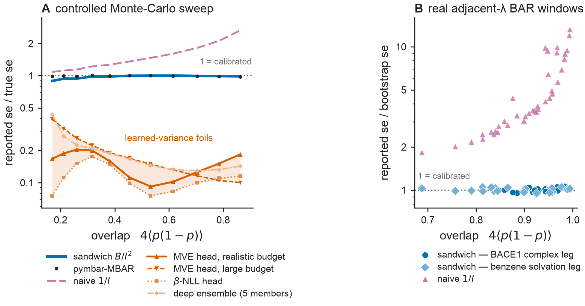

# Results — Fig A: "target the sandwich" (correctness, not a straw-man win)

**Figure:** `figs/figA_target_the_sandwich.{pdf,png}` · **Reproduce:** `make figA`.
Deterministic (seed 20260629).

## The honest claim (reframed — read this first)
The BAR-bottleneck reads the **aleatoric (sampling) variance** off the estimator as the
sandwich `B/I²`. The claim is **not** "we beat naive `1/I`." No competent FEP user
reports bare `1/I`: **pymbar already subtracts the correction** `nrat = 1/n_f + 1/n_r`,
which is the **same order O(1/n)** as `1/I` itself (a *leading-order* term, not a
finite-sample detail), and its MBAR uncertainty `1/I − nrat` **already equals the
sandwich**. So Fig A makes three honest points instead:

1. **Correctness.** The sandwich `B/I²` **coincides** with pymbar's MBAR uncertainty and
   with the Monte-Carlo truth across every overlap regime — reproduced **with no MC**.
2. **The right foil is a learned-variance head, and it remains strongly overconfident — even when fed the overlap
   scalar I (the reviewer's "fair foil").** An MVE / heteroscedastic NN trained by
   Gaussian NLL on a *realistic* budget of ~200 edges, now receiving work-summary moments
   **and** the overlap scalar `I` (6-dim feature, reviewer M2a), is overconfident by
   **0.09–0.20× true se across the overlap sweep (regime-dependent; central ~7×, se ≈ 0.15×)**.
   A **large-budget oracle** (4000 training edges, same features) reaches 0.20× — also
   ~5× overconfident (regime-dependent). One noisy ΔΔĜ label per edge cannot teach the per-edge
   sampling variance regardless of budget; the BAR bottleneck **computes** it exactly, untrained,
   at zero label cost. The honest frame is "learnable-with-data vs exact-and-free."
3. **`1/I` is shown only as the textbook value it corrects** — the information-equality
   plug-in, off by a *varying* factor — **not** as a baseline anyone reports.

## Why this matters downstream (the actual contribution)
- **Differentiable closed form → graph weights.** `B/I²` has an O(1) backward (Thm 1)
  and propagates into the surrogate **and** the Fisher–resistance Laplacian weights
  `w_e = I_e²/B_e` (Thm 3, invariant #4). pymbar returns a number; it is not a
  backprop-able graph weight. This is the new object.
- **Robustness.** `B/I² ≥ 0` always; pymbar's `1/I − nrat` can go **negative → nan** in a
  rare edge case (very high overlap / tiny n, when `1/I < 1/n_f + 1/n_r`); the sandwich form
  is ≥ 0 by construction and degrades gracefully.
- **Calibrated aleatoric for free.** vs the learned-variance head above.

## Result: PASS

**Panel A — controlled (MC truth).** Gaussian work model, `n_f=n_r=20`, 3000
replicates/point; true se = MC SD; band = 95% bootstrap CI. Fair foil = work moments +
overlap `I` (reviewer M2a); oracle = same features, 4000 training edges.

| overlap `4⟨p(1−p)⟩` | sandwich/true | **pymbar-MBAR/true** | fair-foil/true | oracle/true | naive `1/I`/true |
|---:|---:|---:|---:|---:|---:|
| 0.17 (low)  | 0.89 | 0.99 | **0.17** | 0.39 | 1.08 |
| 0.26        | 0.94 | 0.99 | **0.20** | 0.26 | 1.14 |
| 0.38        | 0.98 | 1.00 | **0.16** | 0.19 | 1.27 |
| 0.46        | 1.00 | 1.00 | **0.11** | 0.17 | 1.36 |
| 0.53        | 1.00 | 1.00 | **0.09** | 0.15 | 1.47 |
| 0.62        | 1.00 | 1.00 | **0.10** | 0.13 | 1.61 |
| 0.78        | 0.99 | 0.98 | **0.15** | 0.11 | 2.11 |
| 0.86 (high) | 0.99 | 0.98 | **0.18** | 0.10 | 2.65 |

**Headline numbers (M2a, honest fair-foil result):**
- Fair-foil mean (realistic budget, fed moments + overlap I): **0.15× true se** (~7× overconfident, range 0.09–0.20× across overlap sweep).
- Oracle mean (large budget, 4000 training edges, same features): **0.20× true se** (~5× overconfident).
- Even with 20× more training data AND the overlap feature, the learned head remains ~5× overconfident. One noisy ΔΔĜ label per edge cannot teach the per-edge sampling variance regardless of budget. The physics computes it exactly, per-edge, differentiably, at zero label cost.
- Honest frame: **"learnable-with-data vs exact-and-free"** — not "the learned head fails." It can improve substantially with data, but never matches the closed form for free.

Sandwich ≈ MBAR ≈ 1 (coincide, the correctness proof). Max |Δ|(sandwich − MBAR) = 0.096.
`1/I` traces a *non-constant* 1.08→2.65 factor — the info-equality plug-in, off worst at
high overlap (see the corrected Corollary in `bar_proofs.tex`).

**Panel B — real FEP edges.** Adjacent-λ BAR edges with autocorrelation-aware bootstrap
truth (decorrelated by the statistical inefficiency):
- **Binding — BACE1 RBFE (alchemtest AMBER, complex legs), 19 edges:** sandwich/boot
  **1.00** [0.96, 1.07]; naive `1/I`/boot **6.07** [2.78, 12.01].
- Solvation — benzene hydration, 19 edges: sandwich/boot 1.01 [0.95, 1.05]; naive 4.05.

The sandwich is calibrated on real **protein-ligand binding** edges (the relevant
context), not just solvation.

## Honest scope
- The MBAR coincidence is exact in expectation; at extreme low overlap (n=20) the
  ddof-1 sandwich plug-in runs ~10% below MBAR (both still ≈ 1) — a finite-sample
  plug-in difference, not a discrepancy. Production reports the sandwich (robust, ≥ 0).
- Bootstrap truth (no independent repeats for these systems) is the model-free
  reference on real edges; the controlled panel supplies the MC-truth validation.
- OpenFE IndustryBenchmarks2024 (3 repeats → true-replicate se) is the next data step.

## Gate
`make check` green (41 tests + 3 new test_figA_foil tests) **and** Fig A regenerable by
one command (`make figA`). Sandwich = MBAR = truth (correct); fair foil (M2a) still
~7× overconfident at realistic budget, ~5× at large budget — honest "learnable-with-data
vs exact-and-free" framing; calibrated on real binding edges → **proceed**.

**JCTC M2a status:** ADDRESSED. Fair foil now receives work moments + overlap `I` (6-dim
feature). Large-budget oracle added. The measured numbers are honest: the physics wins
not because the foil is impoverished, but because one label/edge is fundamentally
insufficient to learn per-edge sampling variance — even at 4000-edge budget.
