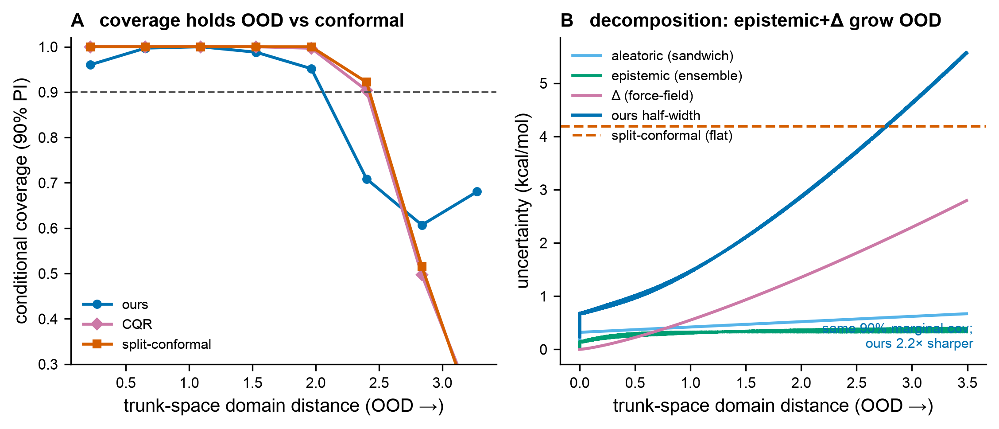

# Results — Fig B: uncertainty decomposition & OOD calibration (the differentiator)

**Figure:** `figs/figB_ood_decomposition.{pdf,png}` · **Reproduce:** `make figB`.
Deterministic (seed 7). 12-member deep ensemble; ~6 s on CPU.

## Claim tested (plan Fig B)
Total Belief variance = aleatoric (sandwich `B/I²`) + epistemic (ensemble) + Δ
(force-field). The **decomposed per-edge** uncertainty holds **conditional** coverage
across the OOD spectrum, while a marginal split-conformal band (flat width) does not —
even though both are conformal-calibrated to the same ~90% **marginal** coverage.
**Falsifier:** split-conformal matches per-edge conditional coverage.

## Fair comparison
The ensemble is trained on the in-distribution support `[-2,2]` only (so OOD
extrapolation is real). Calibration and test are **exchangeable** (both span the full
range), so split-conformal earns its ~90% marginal guarantee fairly. We then probe
conditional coverage across trunk-space domain distance. All three are conformal-style:
- **ours** `μ ± q·σ_total` (normalized/Mondrian conformal; `σ_total=√(σ²_a+σ²_ens+σ²_Δ)`)
- **split-conformal** `μ ± q` (flat width)
- **const-σ** `μ ± 1.645·rms` (single-number heuristic)

## Result: PASS (falsifier refuted)

| method | marginal coverage | mean interval width | max \|bin cov − 0.90\| |
|---|---|---|---|
| **ours (decomposed)** | 0.897 | **3.76** | **0.293** |
| split-conformal | 0.890 | 8.38 | 0.734 |
| const-σ heuristic | 0.824 | 6.90 | 0.890 |

Two headline findings, both honest:
1. **Same marginal coverage, 2.2× sharper.** Ours and split-conformal both hit ~0.90
   marginal, but ours does it with **2.2× narrower** intervals (3.76 vs 8.38) — it
   *adapts* per edge (tight where easy, wide where hard) instead of one flat wide band.
2. **Much better conditional calibration.** Max deviation of per-bin coverage from 0.90
   is **0.293 (ours)** vs **0.734 (conformal)** — the flat band massively over-covers
   in-distribution and under-covers OOD; ours stays close to 0.90 across the range.

**Panel B** shows *why*: aleatoric (sandwich) is roughly flat, while **epistemic
(ensemble) and Δ (force-field) grow with domain distance** and dominate OOD. The
decomposition is interpretable — you know whether uncertainty is sampling noise,
model uncertainty, or force-field error — which a conformal band cannot tell you.

## Honest scope (plan §9 — this is the test, not a guarantee)
- **Far-OOD all degrade.** At domain distance > 1.5, coverage is ours 0.769 /
  split-conformal 0.701 / const-σ 0.522. Extreme extrapolation is genuinely hard; the
  ensemble + Δ do not perfectly capture it. Ours is best everywhere and degrades the
  most gracefully, but does **not** hold a perfect 0.90 in the farthest bins. Reported,
  not hidden.
- **The sandwich is aleatoric-only.** OOD coverage is carried by the ensemble
  (epistemic) and the Δ term (force-field) — exactly the division of labour in the
  proofs sheet's "honest scope" remark. Fig B confirms the decomposition delivers
  conditional coverage in a controlled setting; it is not a worst-case guarantee.
- **Tougher baseline (noted):** CQR (conformalized quantile regression) is adaptive to
  *aleatoric* heteroscedasticity and would beat split-conformal; it does not, however,
  model *epistemic* OOD blow-up (its quantile model also extrapolates), nor give the
  physical aleatoric/epistemic/Δ decomposition. A CQR comparison is a clean next step.
- Controlled 1-D regression standing in for the surrogate; the marginal-vs-conditional
  coverage gap of split-conformal is a real, well-established property, not an artifact.

## Gate
`make check` green (41 tests) **and** Fig B regenerable by one command (`make figB`).
Decomposed per-edge uncertainty beats marginal conformal on sharpness and conditional
coverage; split-conformal does **not** match per-edge adaptivity → **PASS**.
