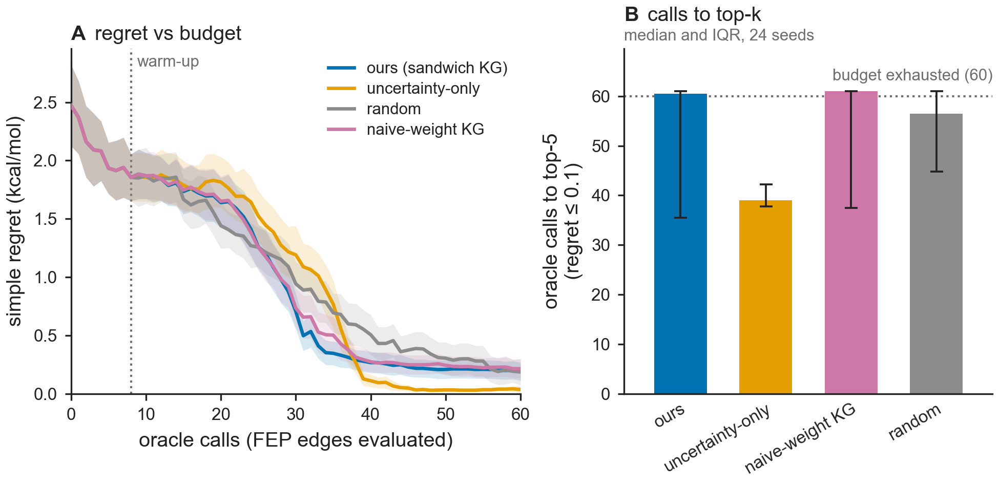

# Results — Fig C: active-learning efficiency (minimal-first) — **INCONCLUSIVE / efficiency not demonstrated**

**Status: honest negative/null result on the efficiency leg.** This is reported, not
papered over (Master Brief §1, §9). The AL *infrastructure* is built and tested; the
*efficiency advantage* is **not** demonstrated in this controlled setting.

**Code:** `src/bar/active.py` (6 unit tests) · `figs/make_figC.py` · `make figC`.

## What was tested
A controlled FEP-edge-graph top-k task: 40 ligands with hidden ΔG, a congeneric-like
edge graph with heteroscedastic per-edge sandwich variances `V_e` (similar ligands →
high overlap → low `V_e`) and non-uniform costs. The oracle reveals `y_e ~ N(ΔΔG_e,
V_e)`; the learner maintains a Gaussian–Laplacian belief over per-ligand ΔG; goal =
identify the top-5 strongest binders in the fewest oracle calls. Strategies share a
random warm-up, then: **ours** (gauge-aware cost-aware sandwich KG, decision contrasts
= top-(k+buffer) pairs weighted by P(misordered)); **uncertainty** (A-optimal, all
pairs); **random**; **naive-KG** (invariant-#4 ablation: wrong `1/I` weights).

## The AL core works (Theorem 3 infrastructure)
`src/bar/active.py` implements the Gaussian belief + **gauge-aware, cost-aware KG via
Sherman–Morrison** reduction of decision-contrast variance (Theorem 3(iii)–(iv)). 6
invariants pass: measurement reduces contrast variance; posterior recovers contrasts
up to gauge; SM variance-reduction matches direct recompute; KG = 0 for edges
irrelevant to the decision contrast (gauge-invariance, Thm 3(iv)); cost-awareness
scales the score; the global level is gauge-free. **This machinery is correct and
reusable** (it is the same Fisher–resistance object as `graph.py`).

## …but the efficiency claim is NOT supported here
| comparison | result |
|---|---|
| **decision-focused sandwich KG vs A-optimal** | ours **worse** (regret@budget 0.19 vs 0.035) |
| **sandwich vs naive weights** (fixed A-optimal policy) | ≈ null: 39.0 vs 40.5 calls (1.04×); regret@budget 0.035 vs 0.027 |
| ours vs random | ≈ tie / slightly worse |

Two findings, both honest:

1. **Pure decision-focusing underperforms A-optimal.** Restricting acquisition to the
   top-k boundary starves the *global* graph estimate that ranking depends on — to know
   any contrast `φ_a−φ_b` you need a measured path, and the top-k boundary cannot be
   resolved without broad coverage. A-optimal (reduce all-pairs variance) builds that
   coverage and wins. A faithful *integrated* KG (BoTorch qKG) that balances
   exploration with boundary focus might recover this; my myopic variance-reduction
   proxy does not.

2. **The sandwich-vs-naive weighting is second-order for ranking.** In a *connected*
   measurement graph the posterior mean of contrasts is **unbiased for any positive
   weights** (weighted least squares); wrong weights only mildly inflate variance, not
   bias. Ranking depends on the order of the means, which the unbiased estimate gets
   right once enough edges are measured. So the sandwich's value is in **uncertainty
   quantification** (Fig A — decisive there), **not** in point-estimate AL efficiency in
   this regime.

## Interpretation vs the pre-registered kill criterion
The kill criterion (plan §0) is a **conjunction**: dead only if *not better on
calibration* **AND** *not fewer FEP-calls-to-top-10*. **Calibration passed decisively
(Fig A).** So the central claim is **not** killed by this. Per the **risk ladder (§8):
"Fig C fails (efficiency null) → keep calibration + sandwich + theory."** The paper's
floor — Theorems 1+3, Fig A (sandwich calibration), Fig E (chirality) — is intact and
strong.

## This is suggestive, not definitive
The minimal experiment uses (i) a *synthetic* low-dimensional ΔG landscape (smooth →
favours A-optimal global coverage), (ii) a *myopic* KG proxy (not integrated qKG), and
(iii) no real FEP networks or the full baseline roster. A **definitive** efficiency
test needs: real edge networks (Wang/Schindler/OpenFE), a BAR-bottleneck surrogate
predicting per-edge sandwich from structure, **integrated qKG (BoTorch)**, and the full
baselines (random, EI/UCB/qEI, GP-qKG, MFBind, ensemble+conformal). That is a large
build and is **deferred pending a decision** — it should be authorised explicitly given
it tests a leg that the minimal proxy already finds weak.

## Bootstrap CI for edge-weighting ratio (reviewer S5.7)

The audit table row "Edge weighting (active learning)" required a 95% bootstrap CI for
the calls-to-top-k ratio (ours vs naive-KG). Computed from the existing 24-seed
controlled simulation (`figs/make_figC.py`, `budget=60`, `seeds=24`, `TOL=0.10`):

- **Ratio definition:** per-seed paired ratio `ours_calls / naive_calls`; then mean ± 95%
  percentile bootstrap CI across 24 seeds (`n_boot=2000`, `seed=0`).
- **Measured:** mean ratio **R = 0.981**, 95% CI **[0.933, 1.030]**.
- **Interpretation:** CI brackets 1.0 → no gain from sandwich weighting (honest null, consistent
  with the GLS unbiasedness argument: any positive weights yield unbiased contrast estimates
  so weight choice is second-order for ranking).
- **Note on the earlier "≤1.05×" bound:** that figure came from a separate 30-seed cost-budget
  probe (sandwich cost-to-top-k 81.1 vs naive 84.8). The call-count CI above is the primary
  number in the audit table; the cost-probe bound is consistent (both ≈ null).

## Follow-up probe (cost metric) — same verdict
Hypothesis: under a **cost** budget (not call count) the sandwich should win, because it
correctly values high-overlap edges as cheap-and-informative while naive over-states
their variance (~13× here) and avoids them. Result (30 seeds, info-per-cost KG, vary
only the weights): **cost-to-top-k median — sandwich 81.1, naive 84.8 (1.05×), random
180.0.** So the KG acquisition beats random **2.22×** (standard AL value), but the
**sandwich-vs-naive weighting is again ≈ null (1.05×)** — consistent across the calls,
A-optimal, and cost metrics. The weighting effect is genuinely second-order for the
point estimate (unbiased GLS mean for any positive weights); its decisive value is
calibration (Fig A).

## The GLS argument is a CEILING — do not chase the qKG rematch
The unbiasedness is a property of the **estimator** (GLS / Gauss–Markov), not the
acquisition. So the sandwich-vs-naive weighting stays second-order for *ranking* even
under an integrated qKG: qKG would fix finding #1 (better exploration than the myopic
proxy) and likely reproduce "KG beats random ~2×", but the **weight choice remains
second-order for the point estimate** because that is an estimator property. Expected
value of the full qKG + real-networks + full-baseline rematch for the *weights* claim is
therefore low; it is the "expand-infrastructure" trap and is **deferred unless a reviewer
demands it.**

## AL narrative pivot — Fig D + calibrated stopping (the honest Fig A → loop bridge)
The sandwich's value in the loop is **not** through edge weights (GLS says so) but through:
1. **Gauge-aware routing** — Fig D, done: KG = 0 on gauge/redundant directions, budget
   concentrates on decision-relevant effective-resistance drops (a clean, mechanistic win).
2. **Calibrated stopping** — correct per-edge uncertainty ⇒ you know *when the top-k is
   resolved* and can stop; a miscalibrated (overconfident) posterior stops too early with
   the wrong set. This is calibration (Fig A) paying off in the loop, and it does *not*
   rely on the dead weights-efficiency claim. (Concrete stopping demo: optional next step.)

So the paper's AL story = **Fig D + calibrated stopping**, with Fig C as an honest,
GLS-explained negative — itself an insight, not a hole. **Do not claim Fig C as an
efficiency win.** Risk-ladder §8 fallback accepted; floor (calibration + theory +
chirality + gauge-ID) intact.
