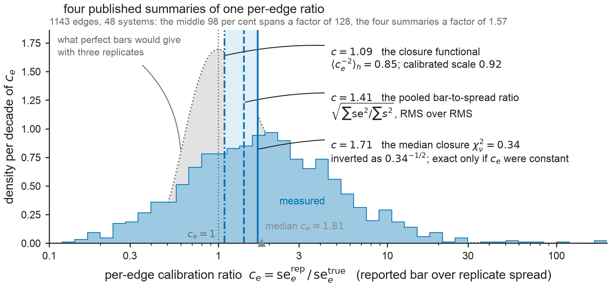

# Results — Fig Cal: one heavy-tailed per-edge ratio, four published summaries

**Figure:** `figs/figCal_calibration_functionals.{pdf,png}` · **Reproduce:** `make figCal`
(or `PYTHONPATH=src python figs/make_figCal.py`). Deterministic
(`SEED = 20260810`, 400 null draws). Edge construction, network fits and
curl-leverages are imported from `figs/make_figOOS.py`, `figs/make_figStab.py` and
`figs/make_figA_replicates.py` rather than reimplemented, so the audit below tests the
shipped generators. Data: `data/openfe_replicates/combined_pymbar4_edge_data.csv` (OpenFE
IndustryBenchmarks2024, public, 3 independent replicates per edge). No new MD.



## What this panel is for

Four numbers are quoted in different sections of the manuscript and a reader loses the
thread by the third: `1.41`, `0.34`, `0.853` and `0.92`. The manuscript says, correctly,
that they do not reduce to one scalar. This panel shows that instead of asserting it: all
four are functionals of ONE distribution, the per-edge calibration ratio
`c_e = se_e^rep / se_e^true`, and the panel draws that distribution with each of them
marked on the `c` scale. **The panel makes no new claim about calibration.** It is a
reading aid for numbers the article already reports, plus an audit of whether each
reproduces from the released generators.

## The edge set and the ratio

1143 edges over 48 systems: `make_figOOS.load_records`, i.e. rows
complete in all three replicates, in systems with at least 3 such edges and at least one
independent cycle. This is the same edge set as Fig Hodge, Fig OOS and check C1 of Fig Inf,
and it is admitted by a **different rule** from Fig Arep's 1145-edge set (which needs no
cycle), so the two counts are not expected to agree and neither replaces the other.

Per edge, in the manuscript's own definition, symmetric in the three replicates:

```
se_e = sqrt(mean_k se_{e,k}^2)      s_e = SD_k(ddG_{e,k}) (ddof = 1)      c_e = se_e / s_e
```

Quartiles 0.906 / 1.806 / 3.604; percentiles 1 to 99
run 0.209 to 26.73; minimum 0.123, maximum 170.0.
27.9% of edges carry a bar tighter than their replicate
spread and 5.2% carry one more than ten times wider. The
first of those is check C6 of Fig Inf computed on this edge set; C6 itself reports 0.279 on
Fig Arep's 1145 edges, and the two are separate computations that happen to agree.

## Do the four published numbers reproduce?

Each was recomputed by **its own released recipe**, not by the symmetric `c_e` above, so
what is tested is the shipped generator.

| published | what it is | recomputed | reproduces? |
|---|---|---:|---|
| `1.41` | pooled reported se over replicate SD, Fig Arep's 1145-edge set | 1.4122 | **yes** (1.41) |
| `0.34` | median reduced χ² over the 48 systems, replicate 0 | 0.3435 | **yes** (0.34) |
| `0.853` | curl-leverage-weighted mean of `c_e^−2` | 0.8462 | **no** — see below |
| `0.92` | calibrated scale `se^true/se^rep`, = √ of the row above | 0.9199 | **yes** (0.92) |

The last row reproduces *because the square root absorbs the mismatch in the row above*:
√0.8462 and √0.8535 both print as `0.92`. The
audit is therefore three independent checks, not four.

### The one that does not reproduce, stated loudly

`0.853` appears in exactly one place in this repository outside this script and this
record: `docs/paper_body.tex`. No released record and no other generator prints it.
The released generator's headline value is
**0.8462**, which `docs/results_figOOS.md` prints as `0.85`.

The third decimal is diagnostic, and the diagnosis is asserted in the script rather than
argued in prose: the **in-sample** variant of the same functional is
0.8535, i.e. `0.853` to three decimals. That variant predicts
replicate 0 from a spread computed on all three replicates, so the predicted replicate
contributes to its own predictor; `docs/results_figOOS.md` reports it for comparison and
states it is **never the quoted number**. The headline value predicts replicate 0 from
replicates 1 and 2 only.

The consequence is small in size and specific in place. Both variants give the calibrated
scale `0.92` at the printed two decimals (√0.8462 = 0.9199, √0.8535 = 0.9238), so
the operating point, the flag counts and the `[0.79, 1.04]` interval — which is the square
root of the **independent** `[0.63, 1.08]` interval — are all unaffected. What is affected
is the derived bar width printed beside it: the manuscript says the bars are wide by
`1.08×` (= 0.853^−1/2), while the released record says **`1.09×`**
(= 0.8462^−1/2 = 1.0871) with interval
`[0.96, 1.26]`.

**No number has been adjusted here and none should be adjusted to fit this figure.** The
finding is reported for the manuscript's owner to act on: the internally consistent pair is
either (`0.85`, `1.09`) from the independent predictor, matching `results_figOOS.md`
and the quoted interval, or (`0.853`, `1.08`) from a variant the record excludes from
quotation.
The figure is drawn at the released headline value.

## Two of the four are one functional

`0.92 = √0.853` by construction — the manuscript derives one from the other in the same
sentence — so on the `c` scale they are a single mark. There are **three distinct
functionals**, not four, and the panel draws three lines. Their positions on the `c` scale:

| functional | as published | on the `c` scale |
|---|---|---:|
| curl-leverage mean of `c^−2` (and its root, the scale) | 0.853 / 0.92 | 1.087 |
| pooled reported se over replicate SD | 1.41 | 1.412 |
| median reduced χ², inverted | 0.34 | 1.706 |

The median-χ² entry is the one that needs a warning label, and the manuscript already
carries it: inverting a median recovers a scalar conservatism only if `c_e` were constant
across edges, which is exactly what this panel shows it is not. It is also not an edge
functional at all — it is a median over 48 **system** statistics, each of them itself a
leverage-weighted mean of `c_e^−2` within its own system — which is why it does not appear
in the power-mean grid below.

## Why the axis is logarithmic

The panel's job is to make the heavy tail visible, and a linear axis cannot do it here.

1. `c_e` is a ratio, so its natural metric is multiplicative: a bar twice too wide
   (`c = 2`) and one twice too tight (`c = 0.5`) are equally miscalibrated in opposite
   directions, and only a logarithmic axis places them symmetrically about 1.
2. The support runs from 0.123 to 170.0. On a linear axis over that range
   the middle half of the edges would occupy 1.6%
   of the axis width and the three functional marks would sit within
   0.4% of it — one line, not
   three.
3. The tail is not a nuisance to be clipped: it is the *reason* the functionals disagree,
   since each of them weights it differently. No edge is dropped, no axis break is used and
   the histogram support covers the measured minimum and maximum.

On the log axis the four published summaries occupy a
1.57× window while the edges span a factor of
128 between their 1st and 99th percentiles. The
distribution's own median, 1.81, sits above all three marks; it is drawn
subordinate because
it is not one of the quoted four (it is published in `docs/results_figInf.md` as the median
per-edge ratio 1.81×).

## How much of the spread is guaranteed by three replicates

This is the caveat that keeps the panel honest, and it is drawn as the grey silhouette.
The denominator of `c_e` is a sample SD on three replicates, so `s²/σ² ~ χ²₂/2` and even if
every reported bar were exactly right the per-edge ratio would be `1/√Exp(1)`, whose law
does not depend on σ. That null is parameter-free, and heavy in its own right:

| | measured | perfect bars, n = 3 |
|---|---:|---:|
| median `c_e` | 1.81 | 1.20 |
| fraction below 1 | 0.279 | 0.368 |
| fraction above 10 | 0.052 | 0.010 |
| percentiles 1 to 99 | 0.21 to 26.7 | 0.47 to 10.0 |

So a reader who sees the tail and concludes that per-edge calibration is wildly
heterogeneous is going too far: a good part of that tail is the denominator's own small-
sample noise. The measured distribution is nonetheless clearly wider than the null on every
row, and the next section quantifies what that does to the four functionals.

## The functional-dependence, quantified

Every one of the published edge functionals is a weighted power mean
`M_p = (Σ w c^p / Σ w)^(1/p)` for some exponent and some weight; naming the pair is what
makes them comparable. The pooled ratio is `M_+2` under weight `s_e²` (that weighting is
what quadrature pooling does, and it is exactly `√(Σ se² / Σ s²)`); the closure functional
is `M_−2` under the curl-leverage weight `h_e`. The grid below is the same 1143 edges under
every combination, with the perfect-calibration null in brackets (median of
400 draws that hold each edge's reported se and redraw its spread).

| weight | `M_−2` | `M_−1` | `M_0` | `M_+1` | `M_+2` |
|---|---:|---:|---:|---:|---:|
| uniform (the typical edge) | 0.78 [1.00] | 1.15 [1.13] | 1.85 [1.33] | 3.57 [1.75] | 9.93 [2.88] |
| `s_e²` (quadrature pooling) | 0.43 [0.71] | 0.54 [0.76] | 0.71 [0.81] | 0.99 [0.89] | 1.41 [1.00] |
| `h_e` (curl-leverage, the closure weight) | 1.08 [1.00] | 1.56 [1.13] | 2.38 [1.33] | 4.26 [1.75] | 10.78 [2.78] |

Read it as follows. **If the ratio were the same on every edge, every cell would hold the
same number** and the four published summaries would agree exactly. Instead the measured
cells range from 0.43 to 10.78, a factor of
25, and the two cells the manuscript actually
quotes — `s_e²` at `M_+2` (1.41 = the published 1.41) and `h_e` at
`M_−2` (1.08) — differ by a third. That second cell is this panel's
symmetric-`c_e` estimator, not the released rotation recipe, which gives
1.087; its agreement to two decimals with the manuscript's
printed
`1.08` is a rounding coincidence between two different estimators and is not a reproduction
of it. The disagreement between the manuscript's numbers is therefore a
property of the ratio distribution, not a discrepancy between measurements, which is what
the manuscript says and what this panel now shows.

Two further readings the grid supports, both stated as bounds rather than corrections:

- Under the null the same grid already ranges from
  0.71 to 2.88, so
  **part of the functional-dependence is guaranteed by n = 3 alone** and only the excess is
  per-edge heterogeneity.
- The `M_+2` cell under uniform weight is the fragile one: under the null the
  expectation of
  `c²` does not exist (`E[1/E]` diverges for `E ~ Exp(1)`), so that cell is a finite-sample
  artefact of the denominator and is not a quantity to quote. The published pooled ratio
  avoids exactly this, because the `s_e²` weight cancels the `1/s²` blow-up — which is why
  its null cell sits at a well-behaved
  1.00 rather than running away.

## What this licenses, and what it does not

- It licenses the manuscript's sentence that the four numbers are different functionals of
  one heavy-tailed distribution and do not reduce to one scalar: that is now shown, with
  the window they occupy and the spread they summarise both measured.
- It does **not** license picking a preferred scalar. The panel is a reason not to.
- It does **not** re-measure calibration. Every value here is recomputed from the released
  generators, and the one that does not reproduce is reported rather than adjusted.
- The restriction that governs every calibration statement in this article governs this one
  too: the three OpenFE repeats share starting coordinates, so the denominator is a lower
  bound on run-to-run reproducibility and every `c_e` here is an upper bound on the
  conservatism a preparation-resampling replicate set would show.

