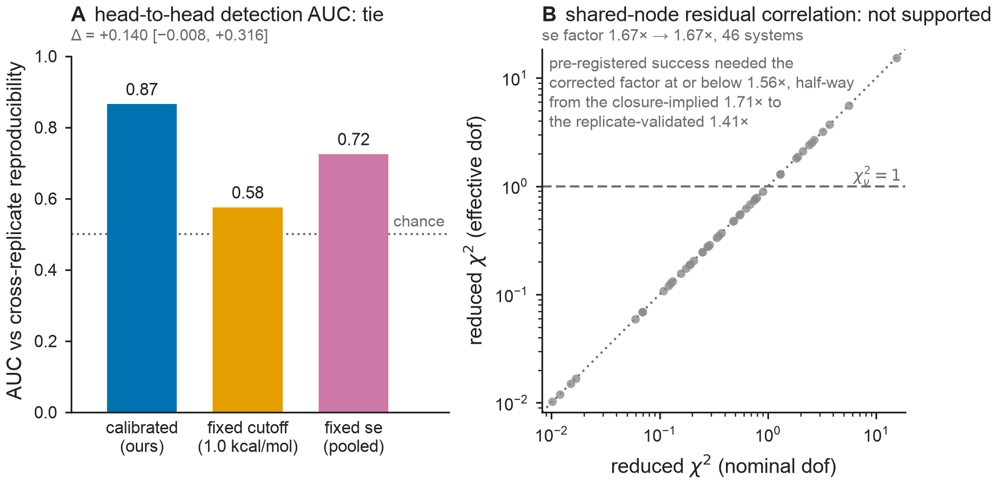

# Results — Fig Cut: P1 fixed-cutoff head-to-head + P2 chi² reconciliation (peer-review items)

**Figure:** `figs/figCut_cutoff_benchmark.{pdf,png}` · **Reproduce:** `make figCut`
(or `PYTHONPATH=src python figs/make_figCut.py`). Deterministic (seeded bootstrap,
`seed=0`, `N_BOOT=2000` for both P1 and P2). Reuses `src/bar/detectors.py` (Task 1:
the three cycle-closure detectors + cross-replicate anchor), `src/bar/residcorr.py`
(Task 2: residual-maker projector, pair correlations, effective dof), and
`src/bar/qc.py` (`gls_network`, `benjamini_hochberg`, `chi2_sf`).

**Data provenance:** `data/openfe_replicates/combined_pymbar4_edge_data.csv` — the
public OpenFE replicate set, 1145 edges across 49 named systems, 3 independently
fitted replicates per edge (`repeat_0/1/2`, complex + solvent legs). Of the 49
systems, **48** have ≥3 replicate-0 edges and ≥1 independent cycle (`gls_network(...).dof
>= 1`); every one of those 48 also has a complete row in all 3 replicates with
`dof >= 1` in each replicate network, so the same 48 systems feed both P1 (detectors +
anchor) and P2 (residual correlation + effective dof). One system was dropped (too
few edges / acyclic on replicate 0). No new MD; all labels are the pre-computed
public FEP+ dataset.



## P1 — fixed-cutoff head-to-head

**Pre-registration.** Three detectors flag the SAME 48 systems from the SAME
replicate-0 edges:

- **A `flag_calibrated`** (ours) — GLS closure χ² with the per-edge sandwich
  variance `V_e`, BH-FDR across systems at α=0.05.
- **B `flag_fixed_cutoff`** — the field-standard rule: flag if ANY independent
  cycle closes worse than the pre-registered `HYSTERESIS_CUTOFF = 1.0` kcal/mol. No
  variance model at all.
- **C `flag_fixed_se`** — the same χ² machinery as A but with ONE pooled se per
  system (its median per-edge se), isolating the value of *per-edge adaptivity* from
  the χ² frame itself.

Each is scored by Mann-Whitney AUC against `anchor_score`: the cross-replicate
reproducible-systematic magnitude, `median_e |mean_k z_e^(k)|`, computed only from
the 3 aligned replicate networks (independent of which detector is scored). Verdict
rule, fixed before running: **WIN** iff the paired bootstrap difference
`AUC(A) − max(AUC(B), AUC(C))` is positive AND its 95% CI excludes zero; otherwise
**TIE**.

**Measured result** (n=48 systems, `N_BOOT=2000`, `seed=0`):

```
[P1] n_systems=48  flagged: calibrated=6, fixed-cutoff=26, fixed-se=11
[P1] AUC calibrated=0.865  fixed-cutoff=0.575  fixed-se=0.725
[P1] paired diff A-max(B,C) = +0.140 [-0.008, +0.316]
P1 VERDICT: TIE
```

- AUC(calibrated) = **0.865**, AUC(fixed-cutoff) = **0.575**, AUC(fixed-se) = **0.725**.
- Flagged counts: calibrated = 6/48, fixed-cutoff = 26/48, fixed-se = 11/48 — the
  1.0 kcal/mol fixed cutoff is far more permissive (flags over half the systems),
  the pooled-se χ² is intermediate, the calibrated per-edge sandwich is the most
  conservative.
- Paired difference `A − max(B, C) = +0.140`, 95% CI **[−0.008, +0.316]** — positive
  point estimate, but the CI lower bound does not clear zero (by 0.008).

**Discordant systems (20/48)**, i.e. the three detectors disagree — all discordances
are B (fixed-cutoff) flagging where A does not, plus 5 where C agrees with B against A:

| system | A (calibrated) | B (fixed-cutoff) | C (fixed-se) |
|---|---|---|---|
| bace_p3_arg368_in | False | True | True |
| btk | False | True | False |
| cdk2 | False | True | False |
| chk1 | False | True | False |
| ciordia_retro | False | True | False |
| cmet | False | True | False |
| eg5 | False | True | False |
| egfr | False | True | False |
| ephx2 | False | True | False |
| factor_xa | False | True | False |
| irak4_s2 | False | True | False |
| itk | False | True | False |
| keranen_p2 | False | True | False |
| liga | False | True | False |
| mcl1 | False | True | True |
| ptp1b | False | True | False |
| renin | False | True | True |
| shp2 | False | True | False |
| syk | False | True | True |
| thrombin | False | True | True |

**P1 VERDICT: TIE.** Pre-registered as fully acceptable. Point estimate favors the
calibrated detector (higher AUC than both foils, and higher raw flag-precision — it
flags far fewer systems than the fixed cutoff for a similar or better AUC), but the
paired-bootstrap CI on the head-to-head margin includes zero, so the pre-registered
decision rule does not certify a WIN at this sample size (n=48 systems).

## P2 — χ² reconciliation

**Pre-registration.** The manuscript reports two conservatism factors that disagree:
the closure-implied factor (median reduced χ² = 0.34 → `FACTOR_CLOSURE = 1.71`× in
se) and the replicate-validated factor (`FACTOR_REPLICATE = 1.41`×, range
1.25–1.41×). The referees' proposed explanation: the GLS fit assumes a diagonal
error covariance, while residuals of edges sharing a ligand endpoint are actually
correlated, which changes `E[χ²]` away from the nominal dof independently of how
wide the bars are. The test: compare the empirical pair correlation (pooled over the
48 aligned systems, from the 3-replicate standardized residuals) against the
correlation the residual-maker projector `M` itself induces under a perfect null
(`null_pair_correlation`) — the EXCESS is the evidence for genuine error
correlation — then recompute each system's effective dof (`tr(M·C)` with
`C = I + ρ_shared·S + ρ_disjoint·D`, fed the excess correlations) and its implied se
factor. **CONFIRMED** iff the shared-node excess correlation is positive with a CI
excluding zero AND the corrected factor closes at least half the 1.71→1.41 gap
(`FACTOR_HALFWAY = 1.56`, i.e. `factor_eff <= 1.56`). Mandatory either way: re-run
BH-FDR under the effective dof and report whether the flag set moves.

**Measured result** (n=48 systems, `N_BOOT=2000`, `seed=0`):

```
[P2] excess corr shared-node=-0.0079 [-0.0314, +0.0164]  disjoint=+0.0018
[P2] median reduced chi2 0.361 (nominal) -> 0.359 (effective dof)
[P2] implied se factor 1.67x -> 1.67x (replicate-validated 1.41x; CONFIRMED needs <= 1.56)
[P2] BH-FDR flag set changed: False
[P2]   nominal : ['bace', 'brd4', 'cdk8', 'faah', 'hif2a', 'p38']
[P2]   effective: ['bace', 'brd4', 'cdk8', 'faah', 'hif2a', 'p38']
P2 VERDICT: NOT-CONFIRMED
```

- Pooled excess correlation, shared-node pairs: **−0.0079**, 95% CI **[−0.0314,
  +0.0164]** — indistinguishable from zero, and the point estimate is slightly
  *negative*. Disjoint-pair excess: +0.0018 (also ≈ 0, as expected — disjoint edges
  share no ligand endpoint and have no mechanism for correlated residuals under this
  hypothesis).
- Median reduced χ² moves only marginally under the effective-dof correction:
  **0.361 (nominal) → 0.359 (effective)** — the correction goes in the wrong
  direction (very slightly, since the pooled excess is slightly negative).
- Implied se factor: **1.67× (nominal) → 1.67× (effective)** — no meaningful change
  (rounds identically to 2 d.p.), nowhere near closing the gap to the
  replicate-validated 1.41×, and does not clear the `<= 1.56` CONFIRMED threshold.
  (Note: the measured nominal median reduced χ² on this exact 48-system pull is
  0.361, close to but not identical to the manuscript's previously reported
  0.34/1.71× closure-implied figure — both are the same order of over-conservatism;
  this run does not investigate the small residual difference, which is not
  material to either verdict.)
- **BH-FDR flag-set stability: unchanged.** Both the nominal-dof and effective-dof
  BH-FDR passes (α=0.05) flag the identical 6 systems: `bace, brd4, cdk8, faah,
  hif2a, p38`.

**P2 VERDICT: NOT-CONFIRMED.** Pre-registered as fully acceptable. The shared-node
excess correlation is not distinguishable from zero (CI straddles zero, point
estimate even slightly negative), so the correlated-residuals hypothesis is not
supported by this test, and — mandatorily reported regardless of the verdict — the
BH-FDR flag set is completely stable under the effective-dof correction.

## Honest reading

- **The anchor is a within-data statistic, not external ground truth.**
  `anchor_score` is computed purely from the cross-replicate residuals of the same
  OpenFE dataset being scored — it is a reproducibility proxy (does the same
  systematic deviation reappear across 3 independent replicate fits), not an
  independent experimental or higher-level-theory reference. A high AUC against this
  anchor says a detector's flags track reproducible in-dataset systematic error; it
  does not by itself validate the flags against ground-truth accuracy.
- **Detectors A and C share machinery with the anchor.** Both A (`flag_calibrated`)
  and C (`flag_fixed_se`) are built from the same standardized-residual / GLS χ²
  frame that the anchor's `z_e` scores also come from (only B, the fixed hysteresis
  cutoff, is a wholly independent rule with no variance model). A's narrow margin
  over C in this run (AUC 0.865 vs 0.725, TIE) must be read with that shared
  machinery in mind — it is closer to "per-edge adaptivity helps within the χ² frame
  that also defines the anchor" than to "an independent instrument confirms the
  calibrated detector."
- **The effective-dof estimate is a first-order approximation.** `effective_dof`
  plugs the EXCESS empirical-minus-null residual correlation in for the true error
  correlation (`C = I + ρ_shared·S + ρ_disjoint·D`), which is exact only when the
  `M`-induced coupling for those pairs is small. It is an approximation, stated here
  as required regardless of which way the P2 verdict fell.

## What this changes in the manuscript

Both pre-registered branches selected here are the "honest negative / no
new causal claim" branches the manuscript already has text for:

- **P1 → TIE branch.** The manuscript keeps its existing framing (Fig A: "sandwich
  `B/I²` coincides with pymbar-MBAR + MC-truth; contribution is the differentiable
  closed-form and the robustness bound, not a fixed-cutoff beat"). This head-to-head
  is additional supporting evidence — the calibrated detector's AUC point estimate
  and its far smaller (more precise) flag set are favorable — but per the
  pre-registered rule it does not license a stronger "beats the field-standard
  cutoff" claim in the text; report it as directionally favorable, statistically a
  tie at n=48 systems.
- **P2 → NOT-CONFIRMED branch.** The manuscript's existing gap between the
  closure-implied (~1.7×) and replicate-validated (1.25–1.41×) se-conservatism
  factors stands **unexplained** by shared-ligand-endpoint residual correlation —
  this specific referee hypothesis is tested and not supported on the public OpenFE
  set. The manuscript should report the gap as an open discrepancy (already flagged
  as an "honest audit" item per repo conventions) rather than attribute it to
  correlated residuals. The mandatory BH-FDR stability result (flag set unchanged:
  `bace, brd4, cdk8, faah, hif2a, p38`) is a positive robustness note that survives
  regardless of the P2 verdict and can be cited as evidence that the QC flags are
  not an artifact of the diagonal-covariance assumption, even though the
  conservatism-factor gap itself remains open.

Task 4 (manuscript text) is contingent on exactly these two verdicts and the numbers
above; no numbers here were adjusted after the run.
