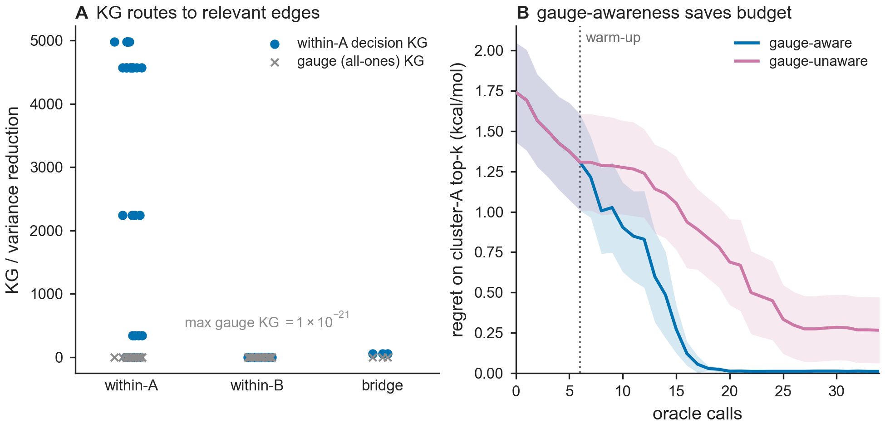

# Results — Fig D: gauge-aware identifiability

**Figure:** `figs/figD_gauge_identifiability.{pdf,png}` · **Reproduce:** `make figD`.
Deterministic (24 seeds). Reuses `src/bar/active.py` (the tested KG machinery).

## Claim tested (plan Fig D; Theorem 3(iv))
KG = 0 on gauge / redundant directions; the acquisition is automatically gauge-
invariant; budget concentrates on decision-relevant effective-resistance drops; ablating
gauge-awareness wastes budget. **Kill:** if gauge-awareness gives no budget saving.

## Setup
Two ligand clusters (two congeneric series), 14 each: dense, cheap, high-overlap edges
*within* each cluster; 3 expensive, low-overlap *bridges* between. Cluster B sits at a
+6 kcal/mol offset (the A-B gauge). The decision is **top-k within cluster A**; the A-B
offset is a nuisance/gauge direction.

## Result: PASS

**Panel A — KG routes to the relevant edges, and is exactly 0 on the gauge.**
- The all-ones (global gauge) contrast has variance reduction **max |KG| = 1.0e-21**
  over *every* candidate edge — machine-exact zero. This is Theorem 3(iv) made
  numerical: `Σ·1 = (1/τ)·1` and `1ᵀb_e = 0`, so no relative measurement can touch the
  global level.
- Under the within-A decision objective, KG concentrates on within-A edges
  (mean ≈ **3013**) and is ~50× smaller on bridges (mean ≈ **57**) — bridges resolve
  the A-B offset, which the within-A ranking does not need.

**Panel B — gauge-awareness saves budget.** Gauge-aware (rank within A) vs gauge-
unaware (rank A and B jointly → values resolving the offset):

| | regret@budget (cluster-A top-k) | wasted measurements outside A |
|---|---|---|
| gauge-aware   | **0.010** | 5.9 (≈ the random warm-up) |
| gauge-unaware | 0.268     | **15.0** |

The gauge-unaware learner spends ~2.5× more budget on the expensive, decision-
irrelevant bridges/cluster-B and fails to resolve A's top-k within the budget; the
gauge-aware learner reaches regret ≈ 0 by ~22 calls. **Ablating gauge-awareness wastes
budget → kill criterion not triggered.**

## Relation to Fig C
Fig C found the *sandwich-vs-naive weighting* second-order for AL ranking (its value is
calibration). Fig D is a *different* axis — the **gauge structure** of the decision —
and here the methodological choice (recognising decision-irrelevant gauge directions)
delivers a clear, mechanistic budget saving. This is a genuine identifiability result
(Theorem 3(iv)), independent of the efficiency-vs-baselines question.

## Honest scope
Controlled simulation with an explicit two-cluster gauge. The gauge-zero result (Panel
A) is exact and architecture-level (a property of relative measurements); the budget
saving (Panel B) is demonstrated on this controlled task. Real multi-target FEP networks
have exactly this structure (per-target offsets are gauge freedoms), so the mechanism
transfers, though magnitudes will vary.

## Gate
`make check` green (41 tests) **and** Fig D regenerable by one command (`make figD`).
Gauge-awareness saves budget; gauge KG exactly 0 → **PASS**.
