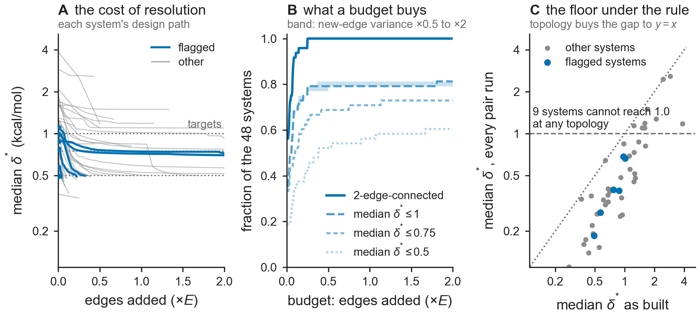

# Results -- Fig Design: from the observability map to a network design rule

**Figure:** `figs/figDesign_network_design_rule.{pdf,png}` | **Table:**
`docs/tab_design.tex` | **Reproduce:** `make figDesign` (or `PYTHONPATH=src python
figs/make_figDesign.py`). Deterministic; there is no randomness anywhere in this script.
Data: replicate 0 of `data/openfe_replicates/combined_pymbar4_edge_data.csv`, the released
OpenFE IndustryBenchmarks2024 set. Reuses `src/bar/leverage.py` (`curl_leverage`,
`bridges`) and `src/bar/qc.py` (`gls_network`). **No molecular dynamics is run and no
number already in the article changes.** This is graph arithmetic on the benchmark
topology and its reported per-edge standard errors, turning the observability map into the
prospective rule it implies but never states.



## The question

Theorem 3 / D1 give the per-edge observability certificate `h_e = 1 - w_e*Omega_e` and the
resolution `delta*_e = sqrt(V_e/h_e)`, the shift at unit noncentrality. Fig Hodge reports
the map and stops: 48 benchmark edges are bridges, `h_e = 0`, carrying no evidence at any
magnitude. That map is the only prospective output the work has, and reporting a bound is
not the same as acting on it. So: **how many edges must be added, and between which
ligands, so that (i) no bridge remains and (ii) the median `delta*` falls below a target?**

## Pre-registration (fixed before the first run)

- **Targets swept, stated before running:** median `delta*` over the system's own edges
  `<= 1.0`, `0.75`, `0.50` kcal/mol, on top of the topology step.
- **Trajectory metric:** median of `delta*_e` over ALL of a system's original edges, a
  bridge counted at `delta* = inf`. The article's tabulated median is taken over auditable
  edges only and so drops the bridges silently; both are reported below, and the
  difference matters (see "What the topology step does not buy").
- **Candidates:** pairs of distinct ligands not already directly connected. A repeat of an
  existing perturbation would also put that edge on a cycle, and is excluded on purpose:
  Fig Lval measures per-edge standardized residuals correlating at r = +0.30 to +0.42
  across independent replicates, so an error that reproduces across repeats is exactly
  what a repeat cannot see. Only a distinct alchemical path closes a cycle against it.
- **Assumed variance of a new edge** (the one thing the arithmetic cannot know, since an
  edge's variance is not known before it is run): that system's own median reported
  variance, swept over 0.5x, 1x and 2x as the pre-registered sensitivity.
- **Budget cap** 2E added edges; separately, the exact complete-graph value decides
  whether a target is reachable at ANY topology.
- **Minimum for (i):** the Eswaran--Tarjan bound `ceil((d+2s)/2)` on the bridge-block
  forest, with a construction emitted and then verified bridgeless and connected, so the
  count is certified minimum rather than asserted.

## (i) The topology step: assumption-free, and cheap

Two different things get conflated by the phrase "remove the bridges", and they cost
different amounts, so both are reported.

- `a_b`: the minimum added edges that leave **no bridge**. Each connected component is
  augmented on its own. This is all that auditability needs: an edge is observable as soon
  as it lies on a cycle, and the closure fit already absorbs one offset per component.
- `a_2`: the minimum added edges that additionally **join the components**, leaving the
  whole network 2-edge-connected. This is the quantity usually meant by
  "2-edge-connected", and it buys cross-component comparability as well as coverage.

```
48 systems, 1143 edges, 48 bridges on 19 systems, 6 systems in more than one component
a_b: 29 added edges leave no bridge  (2.5% of the 1143 edges already run, on 19 systems)
a_2: 36 added edges leave every system 2-edge-connected  (3.1%, on 21 systems)
both constructions == the Eswaran-Tarjan lower bound on 48/48 systems; every
  augmented network verified to have zero bridges, and every a_2 network verified connected
max |h incremental - curl_leverage| on the designed networks: 1.0e-12
brute force: on 39 of the 40 (system, target) pairs needing any edge, EVERY subset of one fewer edge was
  enumerated and none achieves the goal; the rest have too large a space to enumerate
```

- **29 added edges remove all 48 bridges**, 2.5% more
  perturbations than the benchmark already ran; one edge can put several bridges on cycles
  at once, which is why 29 edges suffice for 48 bridges. Making every system
  2-edge-connected as well costs 36, i.e. 3.1%.
- Neither number assumes anything about the new edges. They are properties of the
  topology alone, and are certified minimum: the construction's count is checked against
  the Eswaran--Tarjan lower bound and the result is verified bridgeless. Independently
  of that bound, the script brute-forces the claim wherever the search space allows: for
  39 of the 40 (system, target) pairs that need any
  edge at all, every subset of one fewer edge is enumerated and none achieves the goal.
- The most expensive single system needs 3 for bridge freedom (bace_p3_arg368_in, p38) and 4 for 2-edge-connectivity (p38).
- The per-system counts are in `docs/tab_design.tex`; the ligand pairs themselves are
  listed at the end of this record.

## What the topology step does not buy

Removing the bridges does not make a network sharper. It makes previously invisible edges
visible **at poor resolution**: an edge freshly placed on one long cycle has small `h_e`,
and `delta*_e = se_e / sqrt(h_e)` is correspondingly large. Measured over all of a
system's edges, the median `delta*` after the minimum augmentation is *worse* than the
article's auditable-edges-only median on 3 of the 21 systems that need any augmentation, because the bridges
the article's median excludes are now inside it. Step (i) buys coverage and step (ii)
buys resolution; they are separate purchases, and only (ii) costs a budget worth arguing
about.

## (ii) Reaching a resolution target

Greedy design on top of the `a_2` network: at each step add the ligand pair that most
reduces the median `delta*` over the system's original edges. Unlike (i), these counts are
an **achievable cost, not a proven minimum** -- the greedy is a heuristic and an optimal
design could be cheaper.

```
median delta* <= 1.0 : reachable on 39/48 systems  | unreachable at any topology 9 | over the 2E budget 0
                     17 of those already there as built; the other 22 need a median of 2 added edges (0.07E), at most 65
median delta* <= 0.75: reachable on 35/48 systems  | unreachable at any topology 12 | over the 2E budget 1
                     16 of those already there as built; the other 19 need a median of 3 added edges (0.14E), at most 47
median delta* <= 0.5 : reachable on 29/48 systems  | unreachable at any topology 19 | over the 2E budget 0
                     9 of those already there as built; the other 20 need a median of 3 added edges (0.22E), at most 60
```

- The binding constraint is not topology, it is the edges' own standard errors. Because
  `h_e <= 1` always, `delta*_e >= se_e` pointwise: no design can push an edge's resolution
  below its own reported standard error. Measuring **every** remaining ligand pair still
  leaves 9 of the 48 systems above 1.0 kcal/mol and 19 above 0.5.
- Where a target is reachable and not already met, the cost is real but not prohibitive: a median of 2 edges (0.07E) for 1.0 kcal/mol and 3 edges (0.22E) for 0.5.
- The systems that cannot be brought to 1.0 at any topology are small, or have large
  reported standard errors, or both. Two floors are at work: the pointwise one just
  stated, and a size floor, since a complete graph on `N` ligands with equal weights gives
  `h_e = 1 - 2/N`, so a small network cannot reach high leverage however densely it is
  wired.

  | system | N | E | median se | median delta* as built | every pair run |
  |---|---|---|---|---|---|
  | `egfr` | 5 | 7 | 2.13 | 2.90 | 2.58 |
  | `factor_xa` | 3 | 3 | 1.57 | 2.46 | 2.46 |
  | `jak2_set2` | 8 | 12 | 1.32 | 1.71 | 1.50 |
  | `dlk` | 5 | 6 | 1.00 | 2.09 | 1.27 |
  | `jak1` | 6 | 7 | 0.94 | 1.60 | 1.19 |
  | `ephx2` | 4 | 4 | 0.78 | 3.85 | 1.18 |
  | `itk` | 4 | 5 | 0.80 | 1.24 | 1.14 |
  | `eg5` | 28 | 43 | 1.08 | 1.51 | 1.10 |
  | `irak4_s3` | 4 | 4 | 0.76 | 1.60 | 1.10 |

## Sensitivity to the assumed variance of a new edge

An added edge's variance is not known before it is run, so everything in section (ii)
assumes one; section (i) assumes nothing and is untouched. Sweeping the assumption over a
factor of four, at the 1.0 kcal/mol target:

| assumed new-edge variance | systems reaching 1.0 | median cost among those needing work |
|---|---|---|
| 0.5x the system's median | 39/48 | 2 edges (0.07E), 22 systems |
| 1x the system's median | 39/48 | 2 edges (0.07E), 22 systems |
| 2x the system's median | 38/48 | 2 edges (0.07E), 21 systems |

The verdict (reachable or not) and the count are stable to within a single edge on
93 of the 96 system-by-scale comparisons. The exceptions:

- `btk`: 2 at 1x, 4 at 2x
- `ptp1b`: 62 at 1x, 10 at 0.5x
- `ptp1b`: 62 at 1x, >2E at 2x

These are the systems sitting just at a target, where a greedy path either finds a
cheap route or does not; they are also the clearest evidence that the greedy counts
are an upper bound on the cost and not the cost.

## What this can and cannot say

- **Can:** the two topology counts and the ligand pairs achieving them are exact,
  certified minimum and assumption-free. The reachability verdict is exact too: it
  compares the target against the complete-graph value, which no topology can beat.
- **Cannot:** the edge counts in (ii) assume a variance for edges nobody has run, and the
  sensitivity above is the honest width of that assumption; they are also greedy, so they
  are an achievable cost rather than a minimum.
- **Cannot:** which ligand inside a block to attach is chosen here by graph degree. The
  graph is indifferent between the members of a block; chemistry is not, and a pair the
  graph likes may be a perturbation nobody can run. Treat the counts as the deliverable
  and the named pairs as one legal choice out of many.
- **Cannot:** `delta*` is the shift at unit noncentrality, not a detection threshold. 80%
  power at alpha=0.05 needs 2.8 to 4.7 times it, so a design reaching a median `delta*` of
  1.0 kcal/mol has a median edge that is *resolvable* at 1.0, not one that *detects* a 1.0
  kcal/mol error. The targets are on a resolution scale, and the same caveat the article
  attaches to its tabulated `delta*` attaches here.
- **Cannot:** none of this is validated prospectively. It is arithmetic on one benchmark's
  topology, and what it buys is observability, which Fig Lev already showed does not
  predict where reproducible error actually lands. The rule says where the instrument
  could see, not where the error will be.

## The sentence a practitioner can act on

> When planning a perturbation network, first spend the few edges that leave no bridge:
> across this benchmark that is 29 edges for 48 bridges, 2.5% more than was already
> run, it assumes nothing, and without it those edges carry no evidence at any magnitude.
> Then design for a target `delta*`, remembering that it can never fall below an edge's
> own standard error: a median of 1.0 kcal/mol costs a further 2 edges (0.07E) on the
> 22 systems that need any, and is out of reach at any topology on 9 of 48, where the
> sampling budget and not the graph is what has to change.

## The proposed edges

Ligand pairs whose measurement leaves the network with no bridge (`a_b`), and, where they
differ, the pairs that additionally leave it 2-edge-connected (`a_2`). The counts are
minimum; the specific ligands are one achieving choice out of many, picked by graph degree
and not by chemistry.

```
bace  (2 bridges, 1 component;  a_b = 1, a_2 = 1)
  no bridge:
    CAT-13i  --  CAT-4c
bace_p3_arg368_in  (8 bridges, 1 component;  a_b = 3, a_2 = 3)
  no bridge:
    17f  --  27g
    17g  --  8f
    27f  --  8g
cdk2  (0 bridges, 2 components;  a_b = 0, a_2 = 2)
  2-edge-connected:
    1h1q  --  25
    25  --  31
cdk8  (3 bridges, 1 component;  a_b = 2, a_2 = 2)
  no bridge:
    29  --  45-flipped
    33  --  24
chk1  (1 bridge, 1 component;  a_b = 1, a_2 = 1)
  no bridge:
    24 pose 2  --  11 docked
eg5  (3 bridges, 1 component;  a_b = 2, a_2 = 2)
  no bridge:
    CHEMBL1077204  --  CHEMBL1084935
    CHEMBL1082249  --  CHEMBL1089056
faah  (3 bridges, 1 component;  a_b = 2, a_2 = 2)
  no bridge:
    24  --  6MRG ligand
    27  --  2
hif2a  (1 bridge, 1 component;  a_b = 1, a_2 = 1)
  no bridge:
    124  --  1
hsp90_woodhead  (1 bridge, 1 component;  a_b = 1, a_2 = 1)
  no bridge:
    2  --  3
irak4_s3  (1 bridge, 1 component;  a_b = 1, a_2 = 1)
  no bridge:
    29  --  19charg
jak1  (1 bridge, 1 component;  a_b = 1, a_2 = 1)
  no bridge:
    18charg  --  17
jak2_set1  (1 bridge, 1 component;  a_b = 1, a_2 = 1)
  no bridge:
    4a  --  2_3E63
jnk1  (3 bridges, 2 components;  a_b = 2, a_2 = 2)
  no bridge:
    18660-1  --  18634-1
    19a_charg  --  19b_charg
  2-edge-connected:
    18634-1  --  19a_charg
    18660-1  --  19b_charg
liga  (1 bridge, 1 component;  a_b = 1, a_2 = 1)
  no bridge:
    8  --  11
mcl1  (1 bridge, 2 components;  a_b = 1, a_2 = 2)
  no bridge:
    29  --  27
  2-edge-connected:
    11  --  27
    11  --  29
p38  (5 bridges, 2 components;  a_b = 3, a_2 = 4)
  no bridge:
    2bb  --  3fmh
    2m  --  3fmk
    2y  --  3fln
  2-edge-connected:
    3  --  2bb
    3  --  3fmh
    2m  --  3fmk
    2y  --  3fln
ptp1b  (5 bridges, 2 components;  a_b = 2, a_2 = 3)
  no bridge:
    23469  --  23475
    23470  --  20667
  2-edge-connected:
    20667  --  26charg
    23469  --  23475
    23470  --  26charg
shp2  (2 bridges, 1 component;  a_b = 1, a_2 = 1)
  no bridge:
    3  --  Example-28
syk  (5 bridges, 1 component;  a_b = 2, a_2 = 2)
  no bridge:
    CHEMBL3265010  --  CHEMBL3265025 flip
    CHEMBL3265027  --  CHEMBL3265009
thrombin  (0 bridges, 2 components;  a_b = 0, a_2 = 2)
  2-edge-connected:
    1  --  1b pose 2
    1b pose 2  --  11
tyk2  (1 bridge, 1 component;  a_b = 1, a_2 = 1)
  no bridge:
    ejm_45  --  ejm_46
```
