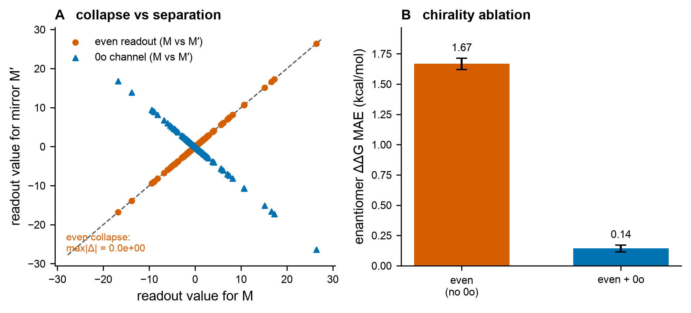

# Results — Fig E: chirality completeness

**Figure:** `figs/figE_chirality_completeness.{pdf,png}` · **Reproduce:** `make figE`.
Deterministic (seeds 0–4). Module under test: `src/bar/chiral.py` (9 unit tests).

## Claim tested (plan Fig E; invariants #5/#6)
An O(3)-invariant ("even") readout — any function of norms `‖v‖`, dot products
`v_i·v_j`, or pairwise distances — is **provably enantiomer-blind**: it gives identical
outputs for a molecule `M` and its mirror `M' = σM`. The single parity-odd `0o`
pseudoscalar `χ(M)=det[p₂−p₁,p₃−p₁,p₄−p₁]` (signed volume / triple product) flips sign
under reflection and separates them. Pairwise distances + `sgn χ` is a complete SO(3)
invariant — O(3) loses exactly the chirality bit; the `0o` channel restores it.

**Kill criterion:** if the even readout already separates enantiomers → the theorem's
premise is violated → investigate.

## Result: PASS (premise holds, ablation decisive)

**Panel A — collapse vs separation.** Over 400 random chiral tetrahedra and their
mirrors: the even readout is **identical** on every pair (max |Δ| = **0.0e+00**,
machine-exact — points lie on `y=x`), while the `0o` channel flips sign (lies on
`y=−x`, median |Δ| = 3.80). The even readout cannot, even in principle, tell
enantiomers apart. **Kill criterion not triggered.**

**Panel B — chirality ablation.** A small MLP (64-64, SiLU) predicts per-enantiomer
ΔG on a designed set of 900 enantiomer pairs (random tetrahedral centres, 4 distinct
substituents, chirality-dependent target `ΔG = achiral(even, subs) + α·sgn(χ)·(s₀−s₃)`).
Enantiomer ΔΔG MAE on held-out pairs (mean ± SD over 5 seeds):

| readout | enantiomer ΔΔG MAE (kcal/mol) |
|---|---|
| even (no `0o`) | **1.667 ± 0.046** |
| even + `0o`    | **0.142 ± 0.028** |

→ the `0o` channel cuts ΔΔG error **11.7×**.

**Why the even MAE is exactly 1.667 (not a coincidence).** Because the even readout
collapses the pair, the model's outputs for `M` and `M'` are identical, so its best
possible ΔΔG prediction is **zero** — its error is forced to equal the true ΔΔG
spread, `mean|ΔΔG| = mean|s₀−s₃|` over distinct substituent pairs from {1,2,3,4} =
20/12 = **1.667**. The even readout literally cannot beat predicting "no enantiomer
difference." The `0o` model recovers the chiral signal down to the noise floor.

## Connection to the architecture
This is the minimal proof of invariant #5: the equivariant trunk's readout **MUST**
include a `0o` channel. Restated for the real trunk (e3nn/MACE, a later figure): enable
**odd irreps** and contract at least one odd (`0o`) scalar into the readout; a
parity-even readout lies in the kernel and is blind. Invariant #6 (predict ΔG
per-enantiomer; racemate ≈ stronger binder) is consistent: the `0o`-aware model
assigns distinct ΔG to the two enantiomers, so the per-enantiomer prediction — and
hence the stronger-binder selection — is well defined.

## Honest scope
- The geometry/target here are synthetic-but-principled (tetrahedral centres, a
  chirality-dependent ΔΔG of realistic ~1.5 kcal/mol scale). The point is the
  *completeness* statement, which is exact (Panel A) and architecture-level, not a
  claim about a specific dataset.
- The readout is the minimal geometric version (triple product). Wiring the same `0o`
  contraction into the frozen e3nn/MACE trunk is deferred to the trunk-dependent
  figures (Fig C/B), where it earns its place against the active-learning / OOD tasks.

## Gate
`make check` green (35 tests, incl. 9 chirality invariants) **and** Fig E regenerable
by one command (`make figE`). Even readout provably collapses; `0o` separates →
**proceed** (next: Fig C active learning, or Fig A binding-edge strengthening).
