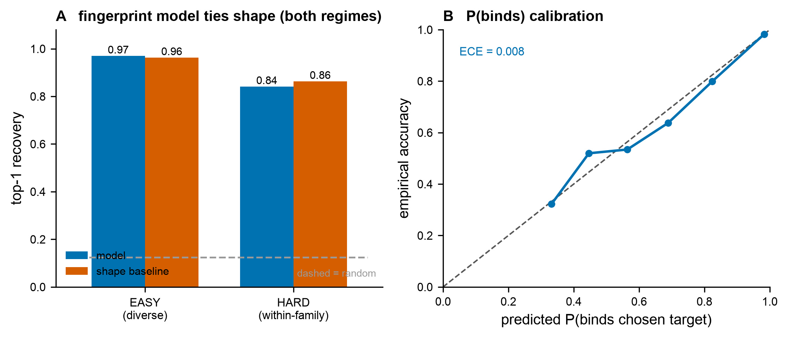

# Results — Fig F: retrospective target identification (STRETCH → case study)

**Figure:** `figs/figF_target_id.{pdf,png}` · **Reproduce:** `make figF` (caches ChEMBL
pulls to `data/figF_chembl_{easy,hard}.csv`, committed for offline reproducibility).

## Claim tested (plan Fig F; stretch)
Hide the target; recover it from a library by predicted binding. Top-k recovery +
P(binds) calibration. **Falsifier:** recovery ≤ shape baseline.

## Setup (real ChEMBL data, two regimes, honest)
Real ChEMBL ligand→target bioactivity (pChEMBL ≥ 6.5); Morgan fingerprints (r=2, 2048);
**Bemis–Murcko scaffold-disjoint split** (per-target, plan §2); promiscuous ligands
(active on ≥ 2 of a regime's targets) dropped for a clean single-target label. A
multiclass logistic model predicts `P(target | ligand)`; reverse screening ranks
targets. **Shape baseline** = max Tanimoto to each target's training actives. Two regimes:
- **EASY** — 8 diverse single-protein targets (kinase / protease / GPCR / NR / …),
  n_test = 1,853. Chemically very different → similarity already solves it.
- **HARD** — 8 within-family aminergic GPCRs (5-HT1A/2A/7, D2, D3, H1, M1, α-2A),
  n_test = 1,415. Shared basic-amine chemotypes → similarity is confounded; the
  meaningful test of whether the model adds discriminative value.

## Result: recovery + calibration work; the model does NOT beat shape (falsifier holds)

| regime | top-1 model | top-1 shape | random | AUROC model | AUROC shape |
|---|---|---|---|---|---|
| EASY (diverse) | 0.97 | 0.96 | 0.12 | 0.992 | 0.992 |
| HARD (within-family) | 0.84 | **0.86** | 0.12 | 0.952 | 0.952 |

Pooled **P(binds) ECE = 0.008** (n = 3,268, scaffold-disjoint).

Three honest findings:
1. **Reverse screening works.** Top-1 recovery 0.84–0.97 vs random 0.12; within-family
   is harder (0.84–0.86) as expected, but still far above chance.
2. **P(binds) is excellently calibrated** (ECE 0.008) — the recovery confidence is
   trustworthy, tying directly to the project's calibration theme.
3. **The model does NOT beat the shape baseline — in EITHER regime** (0.96 vs 0.97 easy;
   0.86 vs 0.84 hard, shape marginally ahead; identical AUROC throughout). The falsifier
   holds robustly, including on the hard within-family task it was designed to probe.

## Interpretation — a clean, motivating negative result (risk-ladder §8)
Both the fingerprint model and the Tanimoto baseline are fundamentally **similarity-
based** (a logistic-on-fingerprints model is essentially a *learned* similarity). For
**ligand-based** target-ID, similarity *is* the signal, so a fingerprint model cannot
transcend it — neither across diverse families nor within a confounded family. Beating
similarity requires **orthogonal information**: 3-D structure / pocket complementarity —
exactly the **structure-aware FEP surrogate** the project is built on, and exactly what
this ligand-only proof-of-concept lacks. So Fig F is reported as a **case study** (per
the pre-registered ladder, "Fig F weak → perspective / case study"): it validates the
reverse-screening *evaluation* and the calibration of P(binds), and it **motivates** the
structure/physics-based approach rather than the ligand-similarity shortcut. This is
*not* a kill — Fig F is a stretch goal, and the central kill criterion (a conjunction
over calibration AND efficiency) was already not triggered (calibration passed, Fig A/B).

## Honest scope
- **Ligand-based, not structure-based.** Labels are ChEMBL bioactivity (not FEP); the
  "surrogate" is a fingerprint QSAR stand-in, not the structure-aware system. A true
  pocket/structure screen (PDBbind/AlphaFold per plan §1) is the next step.
- **Promiscuous ligands removed** for a clean single-target ground truth — this also
  removes the hardest multi-target cases (aminergic ligands are notoriously polypharmic).
- Consistent with the project's pattern: the surrogate's *demonstrated* value is
  **calibration** (Fig A, B, and here ECE 0.008), not raw discrimination on tasks that
  similarity already solves.

## Gate
`make check` green (41 tests; Fig F adds no `src/` code) **and** Fig F regenerable by one
command (`make figF`). Recovery + calibration demonstrated across two regimes;
differentiator null in both → **case study** (plan-anticipated, not a kill).
