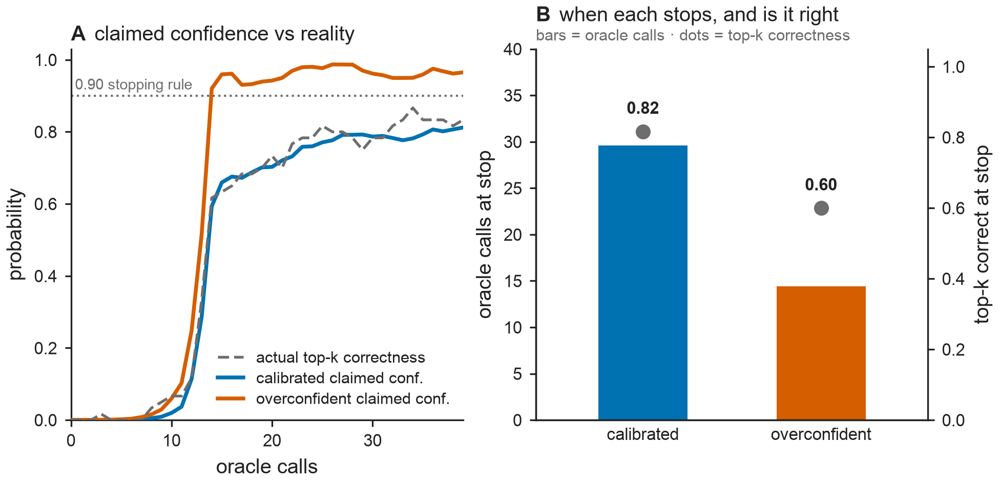

# Results — Fig G: calibrated stopping (the Fig A → active-learning bridge)

**Figure:** `figs/figG_calibrated_stopping.{pdf,png}` · **Reproduce:** `make figG`.
Reuses `src/bar/active.py` + the Fig C problem generator. Deterministic (60 seeds).

## Why this figure exists
Fig C found the sandwich-vs-naive **weighting** is second-order for *ranking* (GLS: the
contrast posterior mean is unbiased for any positive weights), and that this is a
ceiling even for an integrated qKG. So where does the sandwich's calibration pay off in
the loop? **In knowing when to stop.** This figure is the honest Fig A → loop bridge,
and it does **not** rely on the dead weights-efficiency claim.

## Setup
A small, separable FEP-edge graph (16 ligands, top-k = 4). Both learners run the **same**
acquisition and update with the **same correct (true-precision) GLS posterior** — so
their top-k *guess* is identical at every budget. They differ only in the uncertainty
they **assume** when deciding the top-k is resolved:
- **calibrated** — the sandwich posterior covariance (correct).
- **overconfident** — the posterior se scaled by **0.15**, the learned-variance head's
  overconfidence *measured in Fig A* (~7× too small). Same number, reused.

Confidence = `P(current top-k == true top-k)` by Monte-Carlo over the Gaussian posterior
(gauge-safe: a global shift never changes the ranking). Stop at the first budget where
claimed confidence ≥ 0.90.

## Result: calibration → trustworthy stopping

| learner | claimed-vs-actual gap (mean over budget) | stop budget | top-k correct at stop |
|---|---|---|---|
| **calibrated** | **0.022** | 29.6 | **0.82** |
| overconfident | 0.137 | 14.4 | 0.60 |

- **Panel A** — the calibrated learner's claimed confidence **tracks the actual top-k
  correctness** (mean |Δ| = 0.022); the overconfident learner's claimed confidence races
  ahead of reality and crosses the 0.90 stop line while it is still only ~50–60% right.
- **Panel B** — the overconfident learner stops **2× earlier** (14 vs 30 calls) but is
  far **less likely to be correct** (0.60 vs 0.82). Calibration buys a *trustworthy stop*.

## What the assumed-se sweep says about that contrast

The 0.15× arm is one point on a curve, so `make figG` now prints the whole curve: the same
experiment at eight assumed-se scales, with the two starred rows the figure's own arms (the
sweep scales draw from a separate Monte-Carlo stream, so adding them leaves the figure
bit-identical).

| assumed se / true se | stop budget | top-k correct at stop | mean \|claimed − actual\| |
|---|---|---|---|
| 1.06× (conservative) | 30.8 | 0.83 | 0.027 |
| 1.00× (calibrated) * | 29.6 | 0.82 | 0.022 |
| 0.94× | 28.4 | 0.82 | 0.020 |
| 0.80× | 25.4 | 0.82 | 0.029 |
| 0.60× | 21.1 | 0.77 | 0.059 |
| 0.40× | 17.9 | 0.68 | 0.093 |
| 0.20× | 14.9 | 0.60 | 0.127 |
| 0.15× (stand-in) * | 14.4 | 0.60 | 0.137 |

**This is a null against a fair baseline.** 0.94× is the 6% under-estimate a same-budget
estimator pooling single-label edges by overlap reaches on the identical labels (Fig A). At
that scale the stopping decision is indistinguishable from the calibrated one: 28.4 against
29.6 calls at the same 0.82 correctness. Correctness at the stop first moves at 0.60×, and
the halved budget the figure shows needs 0.20×. So the figure's contrast is **a counterfactual
stand-in against a calibrated learner**, not a comparison against any estimator built here or
reported by anyone: it says what a 5–11× under-estimate would cost, and the honest reading of
the sweep is that nothing a realistic same-budget estimator produces costs anything at all.

The one effect that survives the fair comparison is on the safe side: 1.06× spends 30.8 calls
for the same 0.83 correctness, the conservative bar's decision cost measured in Fig J.

## The point
This is calibration (Fig A) paying off in the active-learning loop — through the
**stopping decision**, which depends on the *uncertainty*, not on the edge weights. It
escapes the GLS ceiling that kills the weights-efficiency story (Fig C), and together
with **Fig D** (gauge-aware routing) it is the paper's honest AL narrative:

> the BAR-bottleneck's value in the loop is *calibrated decisions* (when to stop) and
> *gauge-aware routing* (where to spend) — not a weight-tuning efficiency win.

## Honest scope
Controlled simulation; the overconfidence factor is taken from Fig A's measured
learned-variance head, not tuned here, and the sweep above prices what it would take to
matter. The MC confidence is an estimate of
`P(top-k correct)`; for the correct posterior it is calibrated by construction, which is
the very property being demonstrated. A real-FEP-network version is the natural next step.

## Gate
`make check` green (41 tests; Fig G adds no `src/` code) **and** Fig G regenerable by one
command (`make figG`). Calibrated stopping is trustworthy; overconfident stopping is
premature and wrong → the AL narrative (Fig D + calibrated stopping) is supported.
