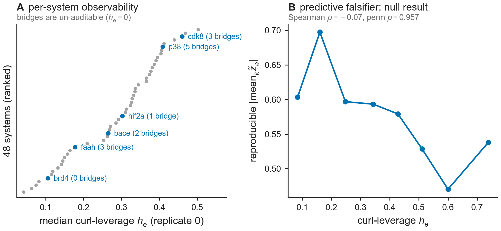

# Results — Fig Lev: per-edge observability map + pre-registered predictive falsifier (D1)

**Figure:** `figs/figLev_observability.{pdf,png}` · **Reproduce:** `make figLev`
(or `PYTHONPATH=src python figs/make_figLev.py`). Deterministic (seeded permutation,
`seed=0`, `N_PERM=10000`). Reuses `src/bar/leverage.py` (Theorem D1: curl-leverage
`h_e`, bridge detection) and `src/bar/qc.py` (`gls_network`, the cycle-closure GLS
fit from Fig L). Data: `data/openfe_replicates/combined_pymbar4_edge_data.csv`
(1145-edge / 48-system / 3-replicate public OpenFE IndustryBenchmarks2024 set — no
new MD).



## What this figure tests

Theorem D1 gives a per-edge **observability map**: `h_e` (curl-leverage) is how much
of edge `e`'s error survives into the cycle-closure residual, with the conservation
law `h_e + w_e·Ω_e = 1` and `Σ_e h_e = dof`. Two separable claims:

1. **Structural** (must hold exactly, it is a proven identity): for every system,
   `Σ_e h_e == dof`, and bridge edges (edges in no cycle) have `h_e == 0` — they are
   structurally un-auditable by cycle closure regardless of data.
2. **Predictive** (pre-registered, falsifiable, *not* a corollary of the theorem):
   does `h_e` predict where *reproducible* systematic error actually concentrates in
   real data? A raw `Spearman(h, |z|)` is positive by construction under the sampling
   null alone (`Var(z_e) = h_e`), so the pre-registered statistic studentizes
   `z̃ = z/√h` (unit null variance) and tests the cross-replicate reproducible
   magnitude `S_e = |mean_k z̃_e|` against `h_e`, using a **within-system
   block-permutation null** (permuting `S_e` only within each system, preserving each
   system's own margin, so no between-system confound can inflate the null).

Pre-registered decision rule (fixed before running, not tuned afterward):
`CONFIRMED` if `rho > 0` and permutation `p < 0.05` → observability predicts
detectable systematic error; `KILL` if `p >= 0.05` → drop only the predictive claim,
the structural theorem and the bridge/auditability map stand regardless.

## Structural result

```
[structural] 48 systems; sum_h==dof max dev 1.78e-14; total bridges 48
```

- **48/49** systems in the raw CSV had `dof ≥ 1` and `≥3` replicate-0 edges and were
  included (the one excluded system has too few edges for a nontrivial cycle-closure
  fit).
- `Σ_e h_e == dof` holds to **1.78e-14** (machine precision) across all 48 systems —
  the conservation law reproduces exactly on real data, as it must (it is an
  algebraic identity of the GLS projector, cross-checked two independent ways inside
  `curl_leverage`).
- **48 bridge edges total** across the 48 systems (mean ~1/system); these are exactly
  un-auditable (`h_e = 0`) by construction.
- Flagged systems (the Fig L QC flags — `brd4, bace, faah, cdk8, hif2a, p38`) and
  their bridge counts (replicate 0):

  | system | edges | dof | Σh | n_bridge | frac. auditable (`h≥0.05`) | median `h` |
  |---|---|---|---|---|---|---|
  | bace  | 49 | 14 | 14.000 | 2 | 0.796 | 0.265 |
  | brd4  | 8  | 1  | 1.000  | 0 | 0.625 | 0.106 |
  | cdk8  | 63 | 29 | 29.000 | 3 | 0.921 | 0.460 |
  | faah  | 31 | 8  | 8.000  | 3 | 0.710 | 0.178 |
  | hif2a | 59 | 19 | 19.000 | 1 | 0.797 | 0.302 |
  | p38   | 60 | 22 | 22.000 | 5 | 0.900 | 0.409 |

  `brd4` has the lowest median leverage of the flagged systems (`h_med ≈ 0.106`, the
  sparsest network, `dof=1`) — consistent with it being the hardest of the six to
  audit at the individual-edge level even though the Fig L network-level test still
  flags it.

## Predictive falsifier result

```
[predictive] n_edges=934; Spearman rho=-0.073; perm p=0.9571
VERDICT: KILL
```

- **934 pooled edges** across **45 systems** contributed (systems needing all 3
  replicates to share ≥3 common edges after keying, with `h_e ≥ H_MIN = 0.05`, the
  pre-registered auditability floor).
- Observed **Spearman ρ = −0.073** (h vs. studentized reproducible magnitude `S_e`),
  i.e. slightly *negative*, not positive.
- Within-system block-permutation `p = 0.9571` (10000 permutations, seed 0) — far
  above the pre-registered `p < 0.05` threshold, and the sign is wrong besides.
- Decision rule: `CONFIRMED if rho>0 and p<0.05` → neither condition holds →
  **VERDICT: KILL**.

## Honest reading

The predictive claim is **KILLED**: on the real 1145-edge OpenFE replicate set,
curl-leverage `h_e` does *not* predict where reproducible (cross-replicate) systematic
error concentrates, once the sampling-null confound is removed by studentization. The
negative point estimate and `p ≈ 0.96` give no support even at a lenient threshold —
this is a clean, unambiguous null, not a borderline case.

This does **not** touch the structural result, which is a proven identity and
reproduces exactly on real data (`Σh == dof` to 1.78e-14, 48/48 systems). The
observability/auditability map itself — which edges are structurally invisible to
cycle closure (bridges, `h_e = 0`) vs. partially visible (`h_e` between 0 and 1) —
stands as a **diagnostic/audit tool**: it tells you which edges cycle closure *cannot*
see, independent of whether leverage happens to correlate with where errors actually
occurred in this dataset. What is dropped is the stronger, empirical claim that high
observability edges are where reproducible errors concentrate in practice.

Per the pre-registration, `N_PERM`, `H_MIN`, the statistic, and the `p<0.05` threshold
were fixed before this run and were not adjusted after seeing the result. The
manuscript content contingent on this verdict (Task 4) should present D1 as a
**structural** theorem with a proven, machine-exact conservation law and an honest,
pre-registered negative on the predictive extension — not oversell the predictive
claim.
