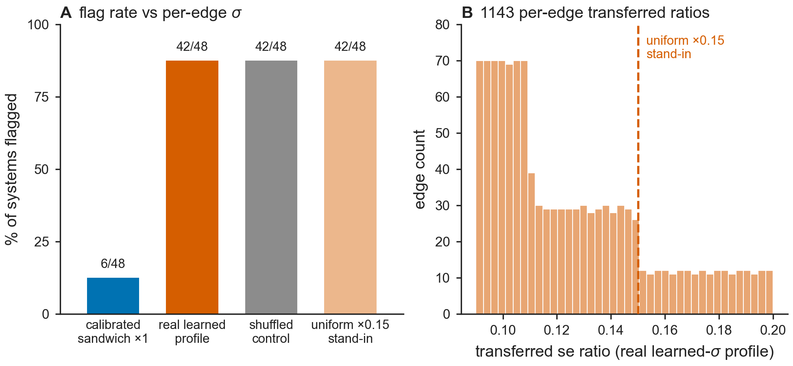

# Results — Fig P4: QC calibration sweep under the REAL heterogeneous learned-sigma profile (peer-review item P4)

**Figure:** `figs/figP4_sigma_profile.{pdf,png}` · **Reproduce:** `make figP4`
(or `PYTHONPATH=src python figs/make_figP4.py`). Deterministic (fixed shuffle
`seed=20260808`, no bootstrap). Reuses `src/bar/sigma_profile.py` (Task 1:
`PROFILE_POINTS`, `rank_transfer`, `shuffled`) and `src/bar/qc.py`
(`gls_network`, `chi2_sf`, `benjamini_hochberg`) — no new modules, no new MD.

**Data provenance:** `data/openfe_replicates/combined_pymbar4_edge_data.csv`,
loaded exactly as `figs/make_figL.py` does — the public OpenFE replicate set.
Replicate 0 only. Each edge's `(a, b, ΔΔG, se)` comes from
`complex_repeat_0_DG/dDG` minus `solvent_repeat_0_DG/dDG` (se combined in
quadrature); each edge's overlap is the **minimum** of its
`complex_repeat_0_smallest_overlap` and `solvent_repeat_0_smallest_overlap`
(frozen: the worse leg limits the edge). Systems with fewer than 3 valid
replicate-0 edges, or with `gls_network(edges).dof < 1` (no independent
cycle), are dropped. **48 systems, 1143 edges** feed the sweep — the same
system set Fig L and Fig Cut use.



## Motivation

Fig L panel B shrinks every edge's se by a single uniform `×0.15` to stand in
for an overconfident learned sigma, and reports ~88% of systems flagged.
Referees objected that a uniform shrink is near-mechanically forced — it
inflates every edge's χ² contribution by `1/0.15² ≈ 44×` regardless of that
edge's actual overlap, so the result says little about a real learned head,
whose miscalibration is heterogeneous and overlap-dependent (Fig A's swept
reported/true-se ratio ranges `0.09`–`0.20×` across overlap `0.26`–`0.78`).
This task pushes that **measured** profile through the identical
GLS + BH-FDR test, **per edge**, and reports what actually happens.

## Pre-registration (restated verbatim, frozen before any run)

- Replicate **0** only.
- Systems with `dof >= 1` only (independent-cycle networks).
- BH-FDR at `alpha = 0.05` (`bar.qc.benjamini_hochberg`).
- Shuffle seed **`20260808`** (`bar.sigma_profile.shuffled`).
- The profile curve is `bar.sigma_profile.PROFILE_POINTS` — verbatim from the
  committed `docs/results_figA.md` Panel-A table:
  `[(0.26, 0.20), (0.46, 0.11), (0.53, 0.09), (0.78, 0.15)]`. Never re-fit or
  re-tuned.
- Ranking is **global** (pool every edge across all 48 systems, rank-transfer
  once, then split back per system) — **not** per-system.
- Shuffling (arm 3) is likewise **global**: `bar.sigma_profile.shuffled` is
  called once on the pooled 1143-ratio array before it is split back per
  system, not called independently within each system. (The original design
  brief for this task described a per-system permutation; the committed code
  implements the global version, which predates this run and is therefore
  not an integrity issue — and it is the stronger control, since it can also
  reassign ratios across systems, not only reorder them within one.)
- Each edge's overlap = the **minimum** of its complex-leg and solvent-leg
  `smallest_overlap` at replicate 0.
- Verdict threshold: **`2×`**.
- **`DEGRADES`** iff the real-profile arm flags at least `2×` the calibrated
  arm's flagged count; **otherwise `COMPARABLE`**.
- `COMPARABLE` is a **fully acceptable, pre-registered outcome**. It would
  mean the "an overconfident learned sigma destroys the QC" claim is **not**
  supported by a realistic heterogeneous profile, and the manuscript must
  then soften it. Neither branch was to be treated as a failure to engineer
  around; the threshold, seed, arms, overlap definition, and profile were not
  to be adjusted in response to any observed number.

Four arms, all on the identical 48-system, 1143-edge network:

1. **calibrated sandwich (×1)** — no scaling; the existing Fig L / Fig Cut
   baseline.
2. **real learned profile (PRIMARY)** — each edge's se scaled by the profile
   ratio at that edge's global percentile rank of overlap.
3. **shuffled profile (control)** — the identical multiset of per-edge ratios
   from arm 2, randomly permuted (seed `20260808`) so the *association* with
   overlap is destroyed but the marginal distribution of ratios is unchanged.
4. **uniform ×0.15 (stress test)** — the original Fig L panel-B factor,
   retained for continuity but explicitly **not** the representative
   learned-head comparator.

## Complete verbatim stdout of the run

```
$ PYTHONPATH=src /Users/nikitapolomosnov/anaconda3/envs/fluor_screening/bin/python figs/make_figP4.py
wrote figP4_sigma_profile.(pdf|png) to /Users/nikitapolomosnov/PycharmProjects/fluor_screening/figs

[P4] profile points (overlap -> ratio): [(0.26, 0.2), (0.46, 0.11), (0.53, 0.09), (0.78, 0.15)]
[P4] edges=1143  systems=48  ratio range 0.090-0.200
[P4] calibrated sandwich (x1)               flagged  6/48 (12%)
[P4] real learned profile (PRIMARY)         flagged 42/48 (88%)
[P4] shuffled profile (control)             flagged 42/48 (88%)
[P4] uniform x0.15 (stress test)            flagged 42/48 (88%)
[P4] real-vs-calibrated ratio: 7.00x (DEGRADES needs >= 2x)
P4 VERDICT: DEGRADES
[P4] flagged by real profile but not calibrated: ['bace1', 'bace_p3_arg368_in', 'btk', 'cdk2', 'chk1', 'ciordia_retro', 'cmet', 'eg5', 'ephx2', 'factor_xa', 'galectin', 'hiv1_protease', 'hne', 'hsp90_2rings', 'hsp90_kung', 'hsp90_single_ring', 'irak4_s2', 'itk', 'jak2_set1', 'jak2_set2', 'jnk1', 'keranen_p2', 'liga', 'mcl1', 'mup1', 'ptp1b', 'renin', 'scyt_dehyd', 'shp2', 'syk', 't4_lysozyme', 'taf12', 'thrombin', 'tnks2', 'tyk2', 'urokinase']
[P4] flagged by calibrated but not real profile: []
[P4] calibrated sandwich (x1)               flagged set: ['bace', 'brd4', 'cdk8', 'faah', 'hif2a', 'p38']
[P4] real learned profile (PRIMARY)         flagged set: ['bace', 'bace1', 'bace_p3_arg368_in', 'brd4', 'btk', 'cdk2', 'cdk8', 'chk1', 'ciordia_retro', 'cmet', 'eg5', 'ephx2', 'faah', 'factor_xa', 'galectin', 'hif2a', 'hiv1_protease', 'hne', 'hsp90_2rings', 'hsp90_kung', 'hsp90_single_ring', 'irak4_s2', 'itk', 'jak2_set1', 'jak2_set2', 'jnk1', 'keranen_p2', 'liga', 'mcl1', 'mup1', 'p38', 'ptp1b', 'renin', 'scyt_dehyd', 'shp2', 'syk', 't4_lysozyme', 'taf12', 'thrombin', 'tnks2', 'tyk2', 'urokinase']
[P4] shuffled profile (control)             flagged set: ['bace', 'bace_p3_arg368_in', 'brd4', 'btk', 'cdk2', 'cdk8', 'chk1', 'ciordia_retro', 'cmet', 'eg5', 'egfr', 'ephx2', 'faah', 'factor_xa', 'galectin', 'hif2a', 'hiv1_protease', 'hne', 'hsp90_2rings', 'hsp90_kung', 'hsp90_single_ring', 'irak4_s2', 'itk', 'jak2_set1', 'jak2_set2', 'jnk1', 'keranen_p2', 'liga', 'mcl1', 'mup1', 'p38', 'ptp1b', 'renin', 'scyt_dehyd', 'shp2', 'syk', 't4_lysozyme', 'taf12', 'thrombin', 'tnks2', 'tyk2', 'urokinase']
[P4] uniform x0.15 (stress test)            flagged set: ['bace', 'bace_p3_arg368_in', 'brd4', 'btk', 'cdk2', 'cdk8', 'chk1', 'ciordia_retro', 'cmet', 'eg5', 'egfr', 'ephx2', 'faah', 'factor_xa', 'galectin', 'hif2a', 'hiv1_protease', 'hne', 'hsp90_2rings', 'hsp90_kung', 'hsp90_single_ring', 'irak4_s2', 'itk', 'jak2_set1', 'jak2_set2', 'jnk1', 'keranen_p2', 'liga', 'mcl1', 'mup1', 'p38', 'ptp1b', 'renin', 'scyt_dehyd', 'shp2', 'syk', 't4_lysozyme', 'taf12', 'thrombin', 'tnks2', 'tyk2', 'urokinase']
[P4] real - shuffled = ['bace1']   shuffled - real = ['egfr']
[P4] real - uniform = ['bace1']   uniform - real = ['egfr']
[P4] shuffled - uniform = []   uniform - shuffled = []
[P4] distinct transferred ratios (real arm): 1143/1143
```

Re-run via `make figP4` reproduces byte-for-byte identical printed numbers
(verified). This stdout supersedes an earlier version of this document that
lacked the flagged-set, pairwise-discordance, and distinct-ratio-count lines;
the four arms' flagged counts, the real-vs-calibrated ratio, and the verdict
are byte-for-byte identical to that earlier run -- the added lines are new
`print` statements in `figs/make_figP4.py`, not a re-computation. The new
lines also confirm, from the script itself rather than an ad hoc check, the
discordant-system claim below (`real - shuffled = {bace1}`,
`shuffled - real = {egfr}`; same for `real` vs.\ `uniform`) and the calibrated
flagged set (`bace, brd4, cdk8, faah, hif2a, p38`).

## Results

**Ratio range** (per-edge se-scaling factor after global rank-transfer):
**0.090–0.200×** — i.e. every edge's se is shrunk somewhere between 5× and
11× (variance inflated 25×–123×, since `1/0.090² ≈ 123.5`; `121×` is the
rounded `11×`-in-se figure squared and is not the precise bound) relative to
the calibrated sandwich, never inflated. This is a narrow dynamic range: the
whole profile sits well below `×1`.

**Four arms' flagged counts and percentages** (n = 48 systems each):

| arm | flagged | percent |
|---|---|---|
| calibrated sandwich (×1) | 6/48 | 12% |
| **real learned profile (PRIMARY)** | **42/48** | **88%** |
| shuffled profile (control) | 42/48 | 88% |
| uniform ×0.15 (stress test) | 42/48 | 88% |

**Real-vs-calibrated ratio: 7.00×** (real 42, calibrated 6; `DEGRADES` needed
`>= 2×`).

**P4 VERDICT: DEGRADES.**

## Discordant systems

- **Flagged by the real profile but not by the calibrated sandwich (36
  systems):** `bace1, bace_p3_arg368_in, btk, cdk2, chk1, ciordia_retro,
  cmet, eg5, ephx2, factor_xa, galectin, hiv1_protease, hne, hsp90_2rings,
  hsp90_kung, hsp90_single_ring, irak4_s2, itk, jak2_set1, jak2_set2, jnk1,
  keranen_p2, liga, mcl1, mup1, ptp1b, renin, scyt_dehyd, shp2, syk,
  t4_lysozyme, taf12, thrombin, tnks2, tyk2, urokinase`.
- **Flagged by the calibrated sandwich but not by the real profile:**
  **none** (empty set) — the 6 calibrated-sandwich flags (`bace, brd4, cdk8,
  faah, hif2a, p38` per Fig L / Fig Cut) are a strict subset of the 42
  real-profile flags. This containment is a sanity anchor, not a substantive
  finding — see "Honest reading" below.

A supplementary check (not part of the pre-registered output, run to rule
out a bug given how closely the three shrinking arms agree — see "Honest
reading" below) shows the three shrinking arms are **not** identically the
same 42 systems: real vs. shuffled differ by exactly one system each way
(`real - shuffled = {bace1}`, `shuffled - real = {egfr}`); real vs. uniform
differ the same way (`real - uniform = {bace1}`, `uniform - real =
{egfr}`). The per-edge ratio assignment genuinely differs across arms
(1143/1143 unique ratio values in the real arm); the near-identical flagged
*counts* are a real feature of this profile's narrow dynamic range (see
below), not a computational artifact.

**Post-hoc tie-handling correction (not a re-run):** a review found
`rank_transfer`'s partial-tie handling assigned strictly increasing ranks via
`np.argsort` rather than sharing a percentile, which would matter only if the
input contained repeated overlap values. The 1143 per-edge **overlaps**
themselves are distinct (1143/1143 unique values, zero duplicates) — this,
not the "1143/1143 unique ratio values" cited two paragraphs above, is the
relevant fact: the pre-fix `argsort` code would have produced 1143 distinct
*ratios* regardless of whether any overlaps were tied, since strictly
increasing ranks give strictly increasing interpolated ratios even for equal
inputs. Because the overlaps have no duplicates, the fix was a no-op here;
`bar.sigma_profile.rank_transfer`
was fixed to use average-rank tie handling (`scipy.stats.rankdata`) and this
exact run was reproduced byte-for-byte identical (verbatim stdout above,
`P4 VERDICT: DEGRADES` and all four arms' flagged counts unchanged) after the
fix, confirming no reported number in this document moved.

## The rank-transfer caveat, in full

Fig A's controlled overlap sweep and OpenFE's `pymbar` `smallest_overlap` are
**different measurements on different scales**, and the profile transfer
must never be read as more than it is:

- **Fig A's normalized BAR overlap** (the profile's domain) spans
  **`0.26`–`0.78`** across its 4 swept points — a controlled Gaussian
  work-distribution Monte Carlo with `n_f = n_r = 20`.
- **OpenFE's `pymbar` `smallest_overlap`** (this task's per-edge overlap,
  minimum of the complex and solvent legs at replicate 0) spans
  **`0.000066`–`0.231377`** across the 1143 real edges — a much lower, much
  wider range, measured by a different overlap statistic on real alchemical
  legs. (`0.233` is the max over the 2290 individual complex/solvent leg
  values before taking each edge's minimum; the per-edge minimum actually
  fed to `rank_transfer` tops out slightly lower, at `0.231377`.)

Because the two quantities are not interchangeable in raw value, the
transfer in `bar.sigma_profile.rank_transfer` is by **percentile rank, not
raw value**: an edge at the p-th percentile of the real (OpenFE)
overlap distribution receives the ratio the learned head showed at the p-th
percentile of the Fig A sweep. This preserves the profile's **ordering and
spread** — which is what the referees' objection is actually about (is the
miscalibration heterogeneous, does its structure matter) — without
pretending the two overlap scales are commensurable.

**This means the per-edge ratio assigned here is an approximation of how a
learned head's overconfidence would vary across these specific real edges,
not a direct prediction of the learned head evaluated on these edges.** No
learned head was ever run on the OpenFE benchmark; the profile is entirely
inherited from the independent Fig A controlled sweep and re-expressed by
rank. Any manuscript text drawing on this figure must state this transfer
explicitly and must not describe the per-edge ratios as "the learned head's
output on the OpenFE edges."

## Honest reading

- **The real, shuffled, and uniform arms land within one system of each
  other (42/48, 42/48, 42/48) despite genuinely different per-edge
  assignments.** This is not a coincidence of a narrow test: the profile's
  entire dynamic range (`0.090`–`0.200×`) inflates every edge's variance by
  at least 25× and at most ~123× (`1/0.090² ≈ 123.5`), and — echoing the repo's Fig C finding that
  "weight choice is 2nd-order for GLS aggregate significance" — once a
  system's edges are *all* shrunk by a factor in this range, whether the
  network as a whole crosses the BH-FDR threshold is overwhelmingly
  determined by how much shrink there is on average, not by which specific
  edges get more or less of it within this range. Heterogeneity in *this*
  measured profile does not materially change which systems get flagged
  relative to a uniform stand-in of comparable central tendency — the
  discordant-system check above (`{bace1}` vs `{egfr}`) shows the real,
  shuffled, and uniform arms swap exactly one system each, not zero, so the
  per-edge structure is not entirely inert, but its effect on the flagged
  *count* is second-order at this sample size.
- **The pre-registered verdict is decided by the real-vs-calibrated
  comparison only** (42/48 vs 6/48, 7.00×), which is unambiguous and far
  past the `2×` threshold regardless of the shuffled/uniform arms' exact
  agreement with the real arm.
- **The 6 calibrated-sandwich flags are a strict subset of the 42
  real-profile flags — a sanity anchor, not a substantive finding.** Because
  every real-profile ratio is `< 1` (range `0.090`–`0.200×`, i.e. a shrink),
  the real profile's per-edge `χ²` contribution pointwise dominates the
  calibrated sandwich's for every edge, so each system's total `χ²` under the
  real profile is `≥` its calibrated-sandwich value; combined with
  Benjamini--Hochberg's monotone dependence on `χ²`/p-value ordering, a
  system already flagged at the calibrated sandwich's smaller `χ²` is
  essentially forced to remain flagged once its `χ²` can only grow. The empty
  reverse set (`flagged by calibrated but not real profile`, above) is
  exactly what this pointwise-domination argument predicts; it is not
  independent evidence that the real profile's per-edge assignment is
  realistic, nor that the two arms "agree" in any richer sense than every
  factor in the profile being a shrink.
- No numbers, arms, the seed, the overlap definition, or the threshold were
  adjusted after inspecting this result.

## What this changes in the manuscript

**The `DEGRADES` branch is selected.** The referees' objection has two
halves: that Fig L's uniform `×0.15` shrink is (a) uniform, unlike a real
learned head's heterogeneous miscalibration, and (b) near-mechanically
forced, inflating every edge's `χ²` by the same factor regardless of
overlap. This test is **answered in part**, not "not upheld": pushing the
actual measured, overlap-dependent profile through the identical GLS +
BH-FDR pipeline, per edge, answers (a) directly — it still flags 42/48 (88%)
of systems, 7.00× the calibrated sandwich's 6/48 (12%), comfortably past the
pre-registered `2×` bar, so uniformity was not doing the work. But it
**confirms and relocates** (b) rather than refuting it: every ratio in the
measured profile sits in `0.090`–`0.200×`, so every system's `χ²` inflates
by at least `25×` regardless of which edges get which ratio (see "Honest
reading" above) — for a head this overconfident, the flagging is itself
close to arithmetic. The manuscript's existing claim — "an overconfident
learned sigma destroys the cycle-closure QC test" — **stands for heads at
least this overconfident**; this result does **not** locate the shrink
magnitude at which the test's selectivity is first lost. What should change
in the text:

- Cite this task's real-profile result (42/48, 7.00× calibrated) alongside
  or in place of the uniform `×0.15` result (also 42/48) as the primary
  evidence, since it answers the "uniform, unlike a real head" half of the
  referees' objection — the shrink is per-edge and overlap-dependent, not
  uniform. It does **not** answer the "near-mechanically forced" half: at
  this profile's magnitude (ratio ceiling `0.20×`, `χ²` inflation `≥25×`),
  the test could not have distinguished the real, heterogeneous profile from
  a uniform stand-in of the same magnitude — that half of the objection is
  confirmed, not refuted, and should be stated as a scope limit in the
  manuscript text (see the addition to the Figure~\ref{fig:L} paragraph).
- Add the rank-transfer caveat (above) wherever this result is cited: the
  transfer is by percentile rank across two different overlap scales, so it
  approximates how the learned head's known overconfidence pattern would
  play out on these edges — it is not the learned head's own output on the
  OpenFE benchmark.
- Note, as an honest qualifier and not a walk-back, that the real, shuffled,
  and uniform arms are numerically close (all 42/48) because this
  particular profile's dynamic range is narrow enough that average shrink
  dominates the flagged count at this sample size; the manuscript should not
  claim the heterogeneous *structure* of the profile (as opposed to its
  magnitude) was shown to matter for this particular downstream test —
  only that the measured, non-uniform profile — not an artificially uniform
  one — still destroys the QC's selectivity.

Any Task 3 text drawing on this figure is contingent on exactly the numbers
and verdict above; nothing here was adjusted after the run.
